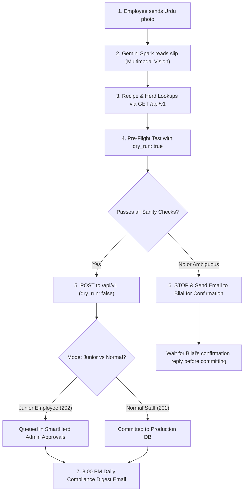

# BA Foods — Machine-to-Machine (M2M) & AI Integration API Specification (v1)

This specification defines the programmatic REST and Webhook interface for **BA Foods / SmartHerd**. It is engineered specifically for autonomous AI agents (such as **Gemini Spark**, Claude, GPT), automated IoT devices, and external webhooks (e.g. Google Sheets, ERP bridges).

---

## 1. Executive Purpose & Governance Safeguards

### 1.0 What This Integration Does
This integration acts as an intelligent, automated bridge connecting physical farm operations to the **SmartHerd Management Portal** using **Gemini Spark**:
1. **Urdu Paper Slip $\rightarrow$ Digital Ledger Translation:** Farm workers record daily feed mixtures, bunk checks, scale weigh-ins, and medicine doses on paper or whiteboards in Urdu. Staff photograph the slips $\rightarrow$ Gemini Spark extracts the data using multimodal vision $\rightarrow$ pushes structured records directly into SmartHerd.
2. **Junior Employee Governance & Supervision:** Eliminates the risk of an AI agent corrupting live databases. Submissions are staged in the **SmartHerd Admin Approvals queue (`ba_pending_approvals`)** for Bilal's one-click review until the Admin toggles the AI to "Normal Staff" mode.
3. **Conversational Farm Encyclopedia:** Enables Bilal and management to ask questions in plain English or Urdu (*"What was the landed weight and feed cost of tag 57?"*, *"What is Pen A's current biomass and ADG?"*) and receive exact figures in seconds via the live API / MCP connection.
4. **Automated Daily Audit & Compliance:** Automatically queries daily operations at 8:00 PM to verify that all pens were fed, bunk scores recorded, and withdrawal periods observed, drafting an evening compliance report.

---

### 1.1 Dual Governance Architecture (Junior Employee vs. Normal Staff Mode)
To eliminate any risk of an AI agent "going rogue" or corrupting farm records, the API implements a **two-tier governance model** controlled by an Admin Switch:

1. **Junior Employee Mode (`ai_require_approval = true`, Default):**
   * The AI functions strictly like a newly onboarded junior employee.
   * Every action submitted by the AI (daily feeding logs, bunk checks, scale weigh-ins, health treatments, feed/medicine purchases, animal intakes, and custom mixing batches) is validated by mathematical and biological guards, then **queued into the SmartHerd Admin Approval queue (`ba_pending_approvals`)** with HTTP `202 Accepted` (`status: "pending_approval"`).
   * Nothing touches the live active herd or feed database until the Admin (Bilal) reviews and approves it in the SmartHerd portal.
2. **Normal SmartHerd Staff Mode (`ai_require_approval = false`):**
   * Once you observe that the AI extracts and logs data reliably, you can toggle the switch to "Normal Staff".
   * Valid entries commit directly to the live production database with HTTP `201 Created` (`status: "committed"`), tagged with `created_by: 'api:gemini-spark'`.
   * Even in this mode, the hard biological sanity clamps remain fully active (it is physically impossible to drop tables, delete records, or enter absurd values).

### 1.2 The Admin Autonomy Switch
The Admin can toggle between Junior Employee Mode and Normal Staff Mode at any time via:
* **SmartHerd Portal UI:** A dedicated **AI Assistant Governance Switch** banner is rendered at the top of the **Admin Approvals** dashboard for superadmins.
* **API Endpoints:**
  * `GET /api/v1/system/approval-mode` — Inspect the current mode.
  * `POST /api/v1/system/approval-mode` — Update the mode (`{"require_approval": false}`).
* **Per-Request Override:**
  * HTTP Header: `x-require-approval: true` or `false`
  * JSON Body: `"require_approval": true` or `false`

### 1.3 Zero-Cost & Anti-Corruption Safeguards
1. **Zero Added Vercel Cost:** Single-table pooled queries execute in **10–25ms** using <40MB RAM.
2. **Strict Append-Only (No Overwrites or Deletes):** Historical records cannot be deleted or wiped out over the AI API. Existing records on the same key return `409 Conflict`.
3. **High-Precision Biological Sanity Clamps:**
   * **Dates:** Format `YYYY-MM-DD`. Future dates ($>1$ day) and distant past ($>30$ days) are blocked.
   * **Weights:** Clamped between $40\text{ kg} - 1200\text{ kg}$. Weight drops $>50\%$ or spikes $>60\%$ trigger `422 SANITY_CHECK_FAILED` to catch OCR dropped/extra zero errors.
   * **Feed Batches:** Ingredient mass balance must sum to `total_batch_kg` within $\pm 1.0\text{ kg}$. Daily cumulative feeding cannot exceed $100\%$.
   * **Bunk Scores:** Must be between $0 - 100\%$.
   * **Anti-Ghost Feeding:** Feeds cannot be logged to a pen with 0 active animals.
4. **Dry-Run Simulation Mode (`dry_run: true`):**
   * Pass `"dry_run": true` (or `?dry_run=true`) to simulate any payload without writing to the database.

### 1.4 Unrestricted, Zero-Friction Read Access (GET Operations)
While mutating actions (`POST`) are protected by the Junior Employee approval queue and biological sanity clamps, **all data fetching (`GET`) operations are 100% unrestricted**:
* **Zero Approvals or Delays:** Read operations never require human approval and execute immediately.
* **Complete Minute Granularity:** The AI has full access to the entire farm state down to individual tags, weight logs since intake, daily ADG calculations, pen biomasses, raw material recipes, bunk scores, and purchasing invoices.
* **Safe & Read-Only:** Queries use pooled, indexed SQL lookups with zero risk of database mutation.

---

## 2. Authentication & Base URL

* **Production Base URL:** `https://bafoods.pk/api/v1` (or local `http://localhost:5173/api/v1`)
* **Headers Required:**
  ```http
  Authorization: Bearer <BA_API_KEY>
  Content-Type: application/json
  x-agent-name: gemini-spark
  ```
  *(Alternatively, pass header `x-api-key: <BA_API_KEY>`)*

---

## 3. GET Endpoints (Unrestricted Data Fetching & Verification)

All GET endpoints are unrestricted and provide deep historical and real-time visibility across the entire farm.

### 3.1 Live Compliance Summary & Multi-Day Fallback
Fetch real-time daily operational compliance for feed sessions, bunk checks, and urgent health alerts. If the target date (today) does not have logs recorded yet (e.g. morning shift underway), the endpoint provides a non-destructive fallback with yesterday's complete compliance and the rolling 7-day trend history.
* **Route:** `GET /api/v1/compliance/summary`
* **Query Parameters:** `date` *(optional YYYY-MM-DD, defaults to today)*
* **Response Example (`200 OK`):**
```json
{
  "success": true,
  "date": "2026-09-10",
  "has_today_data": true,
  "note": null,
  "compliance": {
    "date": "2026-09-10",
    "has_data": true,
    "feed": {
      "is_fully_compliant": true,
      "completion_pct": 100,
      "completed_pens": 5,
      "total_active_pens": 5,
      "pen_details": {
        "A": { "complete": true, "logged_pct": 100, "feedings_recorded": 2 },
        "B": { "complete": true, "logged_pct": 100, "feedings_recorded": 2 },
        "C": { "complete": true, "logged_pct": 100, "feedings_recorded": 2 },
        "D": { "complete": true, "logged_pct": 100, "feedings_recorded": 2 },
        "E": { "complete": true, "logged_pct": 100, "feedings_recorded": 2 }
      }
    },
    "bunk_checks": {
      "completed_pens": 5,
      "total_active_pens": 5,
      "pen_details": {
        "A": { "checked": true, "sessions": ["Morning", "Evening"], "latest_bunk_score": 0 }
      }
    }
  },
  "yesterday_compliance": {
    "date": "2026-09-09",
    "has_data": true,
    "feed": {
      "is_fully_compliant": true,
      "completion_pct": 100,
      "completed_pens": 5,
      "total_active_pens": 5
    }
  },
  "last_7_days_trend": [
    { "date": "2026-09-09", "feed_completion_pct": 100, "completed_pens": "5/5", "bunk_checks_completed": "5/5", "has_logs": true },
    { "date": "2026-09-08", "feed_completion_pct": 100, "completed_pens": "5/5", "bunk_checks_completed": "5/5", "has_logs": true },
    { "date": "2026-09-07", "feed_completion_pct": 100, "completed_pens": "5/5", "bunk_checks_completed": "5/5", "has_logs": true },
    { "date": "2026-09-06", "feed_completion_pct": 100, "completed_pens": "5/5", "bunk_checks_completed": "5/5", "has_logs": true },
    { "date": "2026-09-05", "feed_completion_pct": 100, "completed_pens": "5/5", "bunk_checks_completed": "5/5", "has_logs": true },
    { "date": "2026-09-04", "feed_completion_pct": 100, "completed_pens": "5/5", "bunk_checks_completed": "5/5", "has_logs": true },
    { "date": "2026-09-03", "feed_completion_pct": 100, "completed_pens": "5/5", "bunk_checks_completed": "5/5", "has_logs": true }
  ],
  "seven_day_avg_feed_compliance_pct": 85,
  "health_alerts": {
    "sick_animals_count": 0,
    "sick_animal_tags": []
  }
}
```

---

### 3.2 Cattle Herd Roster
List all active cattle with pens, current weights, entry dates, and Days on Feed (DOF).
* **Route:** `GET /api/v1/cattle/roster`
* **Query Parameters:** `pen` *(optional, e.g. `?pen=C`)*
* **Response Example (`200 OK`):**
```json
{
  "success": true,
  "total_active_cattle": 128,
  "animals": [
    {
      "tag": "101",
      "pen": "A",
      "breed": "Sahiwal Cross",
      "current_weight_kg": 245.5,
      "entry_weight_kg": 180.0,
      "entry_date": "2026-06-01",
      "days_on_feed": 105,
      "target_adg": 1.25,
      "status": "Active"
    }
  ]
}
```

---

### 3.3 Individual Cattle Passport / Full Dossier
Fetches every single detail about an individual calf: Mandi weight & purchase breakdown, landed weight, transit shrink %, current weight, total gain, lifetime ADG, feed cost to date, all weigh-ins with session ADG, and every medical treatment administered.
* **Route:** `GET /api/v1/cattle/passport?tag=<TAG>`
* **Response Example (`200 OK`):**
```json
{
  "success": true,
  "animal": {
    "animal_id": 9,
    "tag": "57",
    "pen": "A",
    "breed": "Sahiwal",
    "status": "Fattening",
    "source": "Chiniot",
    "mandi_weight_kg": 132.0,
    "landed_weight_kg": 127.0,
    "transit_shrink_pct": 3.8,
    "current_weight_kg": 181.0,
    "total_weight_gain_kg": 54.0,
    "target_weight_kg": 280.0,
    "entry_date": "2026-07-29",
    "days_on_feed": 47,
    "lifetime_adg": 1.15,
    "mandi_price_pkr": 85000.0,
    "landed_purchase_price_pkr": 88881.0,
    "procurement_breakdown": {
      "mandi_price_pkr": 85000.0,
      "carriage_pkr": 2500.0,
      "mandi_tax_pkr": 500.0,
      "misc_expense_pkr": 881.0,
      "source_market": "Chiniot"
    },
    "feed_cost_to_date_pkr": 12011.48,
    "feed_sessions_count": 79,
    "total_cost_to_date_pkr": 100892.48,
    "cost_per_kg_gain_pkr": 222.43,
    "under_withholding": true,
    "active_withholdings": [
      {
        "date": "2026-08-24",
        "type": "Deworming",
        "medicine": "Ivotec 100ml (4.893 ml)",
        "dosage": "4.893 ml",
        "withholding": 21,
        "notes": null
      }
    ]
  },
  "weight_history": [
    { "date": "2026-07-29", "weight_kg": 127.0, "adg": 0.0 },
    { "date": "2026-08-08", "weight_kg": 164.0, "adg": 3.7 },
    { "date": "2026-08-21", "weight_kg": 175.5, "adg": 0.88 },
    { "date": "2026-09-09", "weight_kg": 181.0, "adg": 0.28 }
  ],
  "treatments": [
    {
      "date": "2026-09-03",
      "type": "Vaccination",
      "medicine": "Pulmovac 100ml (2 ml)",
      "dosage": "2 ml",
      "withholding_days": 0,
      "notes": "H.S VACCINATION"
    },
    {
      "date": "2026-08-24",
      "type": "Deworming",
      "medicine": "Oxafax Drench 1 ltr (35.945 ml)",
      "dosage": "35.945 ml",
      "withholding_days": 14,
      "notes": null
    }
  ],
  "lifecycle_events": [
    { "date": "2026-08-07", "event_type": "pen_transfer", "from_pen": "B", "to_pen": "A", "note": "Moved B → A" }
  ]
}
```

---

### 3.4 Complete Herd Weight Log History
Fetches granular weight logs across the entire herd or filtered by tag, pen, or date window. Returns exact weight, ADG between weigh-ins, and who logged it.
* **Route:** `GET /api/v1/cattle/weights`
* **Query Parameters:**
  * `tag` *(optional, e.g. `?tag=36`)*
  * `pen` *(optional, e.g. `?pen=C`)*
  * `start_date` *(optional YYYY-MM-DD)*
  * `end_date` *(optional YYYY-MM-DD)*
* **Response Example (`200 OK`):**
```json
{
  "success": true,
  "count": 2,
  "filters": { "tag": "36", "pen": "ALL", "start_date": null, "end_date": null },
  "weight_logs": [
    {
      "id": 412,
      "tag": "36",
      "pen": "B",
      "breed": "Cholistani",
      "date": "2026-09-10",
      "weight_kg": 268.0,
      "adg": 1.14,
      "logged_by": "Scale Operator"
    },
    {
      "id": 310,
      "tag": "36",
      "pen": "B",
      "breed": "Cholistani",
      "date": "2026-08-10",
      "weight_kg": 234.0,
      "adg": 1.10,
      "logged_by": "Scale Operator"
    }
  ]
}
```

---

### 3.5 Pen Roster & Biomass Summary
Returns all active pens with exact head count, average calf weight, total biomass (kg), active ration, and target ADG.
* **Route:** `GET /api/v1/pens`
* **Response Example (`200 OK`):**
```json
{
  "success": true,
  "total_pens": 6,
  "total_active_cattle": 128,
  "pens": [
    {
      "pen": "A",
      "head_count": 22,
      "avg_weight_kg": 235.4,
      "total_biomass_kg": 5178.8,
      "forage_type": "corn_silage",
      "target_adg": 1.30,
      "notes": "Transition group 2"
    },
    {
      "pen": "B",
      "head_count": 24,
      "avg_weight_kg": 272.1,
      "total_biomass_kg": 6530.4,
      "forage_type": "corn_silage",
      "target_adg": 1.40,
      "notes": "Finishing group"
    }
  ]
}
```

---

### 3.6 Daily Feed Distribution Logs
Returns exact TMR split-feedings logged on a given date, including kg-by-kg ingredient breakdown.
* **Route:** `GET /api/v1/feed/logs?date=<YYYY-MM-DD>&pen=<PEN>`
* **Response Example (`200 OK`):**
```json
{
  "success": true,
  "date": "2026-09-14",
  "feed_logs": [
    {
      "pen": "C",
      "feeding_index": 1,
      "num_feedings": 2,
      "feeding_pct": 50,
      "total_batch_kg": 180.0,
      "ingredients": [
        { "name": "Corn Silage", "kg": 120.0 },
        { "name": "Wheat Straw", "kg": 20.0 },
        { "name": "Chokar", "kg": 25.0 },
        { "name": "Corn Grain Ground", "kg": 15.0 }
      ],
      "logged_by": "TMR Mixer Operator",
      "created_at": "2026-09-14T07:15:00Z"
    }
  ]
}
```

---

### 3.7 Daily Pen Checks & Bunk Scores
Returns morning and evening feed bunk scores ($0-100\%$) and health observation flags.
* **Route:** `GET /api/v1/pen-checks?date=<YYYY-MM-DD>`

---

### 3.8 Active Medical Withholding Alerts
Returns all animals currently under slaughter withholding, days remaining, and safe release dates.
* **Route:** `GET /api/v1/health/withholding`

---

### 3.9 Upcoming & Overdue Operations Schedule
Returns all upcoming operations, overdue weigh-ins, scheduled pen weigh dates, quarantine protocols, medical withholding clearances, and market-ready calves across the feedlot.
* **Route:** `GET /api/v1/tasks/upcoming` (Aliases: `/api/v1/tasks/overdue`, `/api/v1/tasks`)
* **MCP Tool:** `get_tasks_upcoming`
* **Query Parameters:**
  * `date` *(optional YYYY-MM-DD, defaults to today)*
  * `pen` *(optional string, e.g. `?pen=D` to filter by pen)*
  * `weigh_interval_days` *(optional integer, defaults to 14 days)*
* **Response Example (`200 OK`):**
```json
{
  "success": true,
  "as_of_date": "2026-09-10",
  "configured_weigh_interval_days": 14,
  "summary": {
    "total_overdue_tasks_count": 3,
    "total_upcoming_tasks_count": 100,
    "overdue_weigh_ins_count": 3,
    "upcoming_weigh_ins_count": 100,
    "active_medical_withholdings_count": 0,
    "market_ready_cattle_count": 1
  },
  "overdue_tasks": {
    "weigh_ins": [
      {
        "tag": "08",
        "pen": "E",
        "breed": "Cross",
        "last_weighed_date": "2026-08-15",
        "last_weight_kg": 135.0,
        "current_weight_kg": 135.0,
        "days_since_last_weigh": 26,
        "days_overdue": 12,
        "urgency": "CRITICAL"
      },
      {
        "tag": "46",
        "pen": "D",
        "breed": "Cross",
        "last_weighed_date": "2026-08-22",
        "last_weight_kg": 201.0,
        "current_weight_kg": 201.0,
        "days_since_last_weigh": 19,
        "days_overdue": 5,
        "urgency": "HIGH"
      },
      {
        "tag": "58",
        "pen": "D",
        "breed": "Cross",
        "last_weighed_date": "2026-08-22",
        "last_weight_kg": 226.0,
        "current_weight_kg": 226.0,
        "days_since_last_weigh": 19,
        "days_overdue": 5,
        "urgency": "HIGH"
      }
    ],
    "quarantine_graduations": []
  },
  "upcoming_schedule": {
    "pen_weigh_in_schedule": [
      {
        "pen": "C",
        "head_count": 16,
        "next_scheduled_weigh": "2026-09-12",
        "days_until": 2,
        "tags": ["19", "24", "44", "45", "49", "54", "63", "64", "66", "70", "74", "88", "91", "92", "97", "98"]
      },
      {
        "pen": "D",
        "head_count": 15,
        "next_scheduled_weigh": "2026-09-12",
        "days_until": 2,
        "tags": ["09", "20", "21", "26", "32", "40", "43", "52", "56", "62", "77", "78", "82", "89", "99"]
      },
      {
        "pen": "E",
        "head_count": 13,
        "next_scheduled_weigh": "2026-09-12",
        "days_until": 2,
        "tags": ["100", "18", "23", "33", "39", "48", "51", "59", "69", "75", "80", "81", "96"]
      },
      {
        "pen": "G",
        "head_count": 27,
        "next_scheduled_weigh": "2026-09-19",
        "days_until": 9,
        "tags": ["101", "102", "103", "105", "106", "107", "108", "109", "112", "116", "119", "155", "..."]
      },
      {
        "pen": "A",
        "head_count": 19,
        "next_scheduled_weigh": "2026-09-23",
        "days_until": 13,
        "tags": ["17", "29", "30", "31", "36", "37", "38", "42", "47", "50", "53", "57", "60", "..."]
      },
      {
        "pen": "B",
        "head_count": 10,
        "next_scheduled_weigh": "2026-09-23",
        "days_until": 13,
        "tags": ["02", "10", "14", "16", "22", "34", "35", "55", "61", "72"]
      }
    ],
    "quarantine_milestones": [],
    "medical_withholding_clearances": [],
    "market_ready_pipeline": [
      {
        "tag": "49",
        "pen": "C",
        "breed": "Cross",
        "current_weight_kg": 272.5,
        "target_weight_kg": 250.0,
        "surplus_weight_kg": 22.5,
        "status": "Target Weight Achieved — Ready for Sale/Harvest"
      }
    ]
  }
}
```

---

### 3.10 Feed & Medicine Purchasing History
Returns receipts of feed deliveries and veterinary medicines purchased, including unit rates, quantities, and suppliers.
* **Route:** `GET /api/v1/purchasing/history`
* **Query Parameters:** `start_date`, `end_date`, `item_name`
* **Response Example (`200 OK`):**
```json
{
  "success": true,
  "count": 1,
  "purchases": [
    {
      "id": 88,
      "date": "2026-09-12",
      "item_id": "silage_bunker_1",
      "item_name": "Corn Silage",
      "unit": "kg",
      "quantity": 15000.0,
      "rate_per_unit": 12.5,
      "total_cost_pkr": 187500.0,
      "supplier": "Al-Rehman Agri",
      "notes": "32% DM silage batch 4",
      "logged_by": "Bilal Ashraf"
    }
  ]
}
```

---

### 3.11 Feed Stock Inventory Summary
Returns warehouse and bunker inventory levels for all commodities.
* **Route:** `GET /api/v1/inventory/summary`

---

### 3.12 Wanda & Premix Formulas Directory
Returns active in-house Wanda recipes, exact inclusion percentages, and available raw materials.
* **Route:** `GET /api/v1/premix/formulas`

---

### 3.13 AI Governance Status
Check whether the AI is currently operating in Junior Employee mode or Normal Staff mode.
* **Route:** `GET /api/v1/system/approval-mode`
* **Response Example (`200 OK`):**
```json
{
  "success": true,
  "ai_require_approval": true,
  "mode": "junior_employee",
  "description": "Junior Employee Mode active. All AI tasks (feed logs, cattle weights, treatments, purchases, wanda mixing) are held in ba_pending_approvals for Admin review."
}
```

---

### 3.14 Overall Herd ADG & Growth Performance Analytics
Returns the comprehensive macro and micro growth performance of the feedlot: pooled herd average ADG, 30-day rolling ADG, pen-by-pen ADG and biomass, breed performance breakdown, Days on Feed (DOF) cohorts, and cattle currently ready for slaughter/sale.
* **Route:** `GET /api/v1/analytics/performance` (or `/api/v1/analytics/adg`)
* **Response Example (`200 OK`):**
```json
{
  "success": true,
  "as_of_date": "2026-09-14",
  "herd_kpis": {
    "total_active_cattle": 103,
    "total_herd_biomass_kg": 18182.0,
    "average_calf_weight_kg": 176.5,
    "overall_herd_adg_kg_day": 0.46,
    "rolling_30day_adg_kg_day": 0.46,
    "total_monitored_animal_days": 1520,
    "ready_for_sale_head_count": 4
  },
  "pen_performance": [
    {
      "pen": "A",
      "head_count": 19,
      "avg_weight_kg": 177.3,
      "total_biomass_kg": 3369.5,
      "target_adg": 1.10,
      "actual_adg": 0.68,
      "adg_variance": -0.42,
      "performance_status": "Lagging Target"
    },
    {
      "pen": "B",
      "head_count": 10,
      "avg_weight_kg": 205.1,
      "total_biomass_kg": 2050.5,
      "target_adg": 1.40,
      "actual_adg": 0.40,
      "adg_variance": -1.00,
      "performance_status": "Lagging Target"
    }
  ],
  "breed_breakdown": [
    { "breed": "Sahiwal", "head_count": 8, "avg_weight_kg": 172.5, "achieved_adg": 0.61 },
    { "breed": "Cross", "head_count": 93, "avg_weight_kg": 176.8, "achieved_adg": 0.41 }
  ],
  "dof_cohorts": [
    { "cohort": "0-30 days (Intake/Quarantine)", "head_count": 27, "avg_weight_kg": 162.9, "achieved_adg": null },
    { "cohort": "31-60 days (Growing)", "head_count": 31, "avg_weight_kg": 173.2, "achieved_adg": 0.48 }
  ],
  "ready_for_sale_pipeline": [
    {
      "tag": "12",
      "pen": "B",
      "breed": "Sahiwal",
      "current_weight_kg": 285.0,
      "target_weight_kg": 280.0,
      "days_on_feed": 115,
      "withholding_clear": true
    }
  ]
}
```

---

### 3.15 All-In Feedlot Financials, Multi-Day Feed Costs & Diet Comparisons
Returns comprehensive capital, expenditure, and unit economics across the feedlot: total purchase capital, cumulative feed spend, overhead expenses, blended feed cost per kg gain, and portal-calibrated daily feed cost per head. Crucially, provides a complete **Multi-Day Feed Cost Breakdown** (today, yesterday, day before, 7 days ago, rolling 7-day average) and an **Itemized Diet Comparison** detailing commodity changes (kg differences, percentage swings, and price impact).
* **Route:** `GET /api/v1/analytics/financials` (Aliases: `/api/v1/analytics/cost-of-gain`, `/api/v1/feed/diet-comparison`)
* **Query Parameters:** `date` *(optional YYYY-MM-DD, defaults to latest recorded date or today)*
* **Response Example (`200 OK`):**
```json
{
  "success": true,
  "one_off_filter": {
    "applied": true,
    "pre_baseline_feed_excluded": "date < 2026-08-08",
    "uncalibrated_intake_dates_excluded": ["2026-07-29", "2026-08-02"]
  },
  "financial_summary": {
    "total_active_head": 103,
    "total_procurement_cost_pkr": 11298539.0,
    "avg_procurement_cost_per_head_pkr": 109694.55,
    "total_feed_cost_pkr": 618652.59,
    "total_overhead_cost_pkr": 0.0,
    "total_invested_capital_pkr": 11917191.59,
    "cost_per_head_all_in_pkr": 115700.89
  },
  "gain_and_efficiency_economics": {
    "total_measured_weight_gain_kg": 670.0,
    "feed_cost_per_kg_gain_pkr": 923.36,
    "all_in_cost_per_kg_gain_pkr": 923.36,
    "daily_feed_cost_per_head_pkr": 302.52
  },
  "daily_feed_cost_trend": {
    "report_date": "2026-09-10",
    "has_report_date_data": true,
    "note": null,
    "today_cost_per_head_pkr": 267.70,
    "yesterday_cost_per_head_pkr": 294.13,
    "day_before_yesterday_cost_per_head_pkr": 267.57,
    "seven_days_ago_cost_per_head_pkr": 490.06,
    "last_7_days_rolling_avg_pkr": 283.37,
    "overall_baseline_avg_pkr": 302.52,
    "details": {
      "today": {
        "date": "2026-09-10",
        "has_data": true,
        "total_cost_pkr": 27573.08,
        "total_animal_days": 103.0,
        "cost_per_head_pkr": 267.70,
        "total_batch_kg": 1149.5,
        "total_dm_kg": 65.3,
        "sessions_count": 12
      },
      "yesterday": {
        "date": "2026-09-09",
        "has_data": true,
        "total_cost_pkr": 30295.55,
        "total_animal_days": 103.0,
        "cost_per_head_pkr": 294.13,
        "total_batch_kg": 1132.1,
        "total_dm_kg": 65.7,
        "sessions_count": 12
      },
      "day_before": {
        "date": "2026-09-08",
        "has_data": true,
        "total_cost_pkr": 23947.69,
        "total_animal_days": 89.5,
        "cost_per_head_pkr": 267.57,
        "total_batch_kg": 740.6,
        "total_dm_kg": 46.7,
        "sessions_count": 11
      },
      "seven_days_ago": {
        "date": "2026-09-03",
        "has_data": true,
        "total_cost_pkr": 37244.49,
        "total_animal_days": 76.0,
        "cost_per_head_pkr": 490.06,
        "total_batch_kg": 1394.4,
        "total_dm_kg": 113.4,
        "sessions_count": 12
      }
    }
  },
  "diet_comparison": {
    "base_date": "2026-09-10",
    "today_vs_yesterday": {
      "compared_with_date": "2026-09-09",
      "items": [
        { "ingredient": "Chari (Green Fodder)", "today_kg": 295.0, "previous_kg": 153.2, "diff_kg": 141.8, "pct_change": 92.6, "trend": "INCREASED", "price_per_kg_pkr": 11.45, "cost_diff_pkr": 1613.77 },
        { "ingredient": "Maize Silage", "today_kg": 495.0, "previous_kg": 576.1, "diff_kg": -81.1, "pct_change": -14.1, "trend": "DECREASED", "price_per_kg_pkr": 16.25, "cost_diff_pkr": -1318.43 },
        { "ingredient": "Potato (Aloo)", "today_kg": 140.0, "previous_kg": 140.0, "diff_kg": 0.0, "pct_change": 0.0, "trend": "UNCHANGED", "price_per_kg_pkr": 11.50, "cost_diff_pkr": 0.03 },
        { "ingredient": "Wanda (Potato Max Wanda)", "today_kg": 16.0, "previous_kg": 0.0, "diff_kg": 16.0, "pct_change": 100.0, "trend": "NEW_ADDITION", "price_per_kg_pkr": 73.84, "cost_diff_pkr": 1181.66 },
        { "ingredient": "Wanda (Single Bag Wanda)", "today_kg": 166.0, "previous_kg": 221.2, "diff_kg": -55.2, "pct_change": -25.0, "trend": "DECREASED", "price_per_kg_pkr": 73.74, "cost_diff_pkr": -4070.84 },
        { "ingredient": "Wheat Straw (Toori)", "today_kg": 37.5, "previous_kg": 41.6, "diff_kg": -4.1, "pct_change": -9.9, "trend": "DECREASED", "price_per_kg_pkr": 31.25, "cost_diff_pkr": -128.67 }
      ]
    },
    "today_vs_7_days_ago": {
      "compared_with_date": "2026-09-03",
      "items": [
        { "ingredient": "Chari (Green Fodder)", "today_kg": 295.0, "previous_kg": 0.0, "diff_kg": 295.0, "pct_change": 100.0, "trend": "NEW_ADDITION", "price_per_kg_pkr": 11.45, "cost_diff_pkr": 3325.55 },
        { "ingredient": "Maize Silage", "today_kg": 495.0, "previous_kg": 769.4, "diff_kg": -274.4, "pct_change": -35.7, "trend": "DECREASED", "price_per_kg_pkr": 16.25, "cost_diff_pkr": -4459.0 },
        { "ingredient": "Potato (Aloo)", "today_kg": 140.0, "previous_kg": 241.0, "diff_kg": -101.0, "pct_change": -41.9, "trend": "DECREASED", "price_per_kg_pkr": 11.50, "cost_diff_pkr": -1161.5 },
        { "ingredient": "Wanda (Single Bag Wanda)", "today_kg": 166.0, "previous_kg": 344.0, "diff_kg": -178.0, "pct_change": -51.7, "trend": "DECREASED", "price_per_kg_pkr": 73.74, "cost_diff_pkr": -13125.72 }
      ]
    }
  },
  "valuation_and_margin": {
    "total_herd_biomass_kg": 18182.0,
    "assumed_live_rate_per_kg_pkr": 850,
    "estimated_herd_market_value_pkr": 15454700.0,
    "unrealized_gross_margin_pkr": 3537508.41,
    "margin_status": "Profitable"
  }
}
```

---

### 3.16 Nutritional Efficiency & Feed Conversion Ratio (FCR)
Returns feed utilization efficiency: dry matter FCR (kg DMI per kg gain), total wet & dry matter tonnage fed, and cumulative commodity consumption breakdown.
* **Route:** `GET /api/v1/analytics/feed-efficiency` (or `/api/v1/analytics/fcr`)
* **Response Example (`200 OK`):**
```json
{
  "success": true,
  "feed_efficiency": {
    "fcr_dry_matter_to_gain": 2.6,
    "fcr_benchmark": "Excellent (<6.5)",
    "total_wet_feed_tonnes": 25.15,
    "total_dry_matter_tonnes": 1.74,
    "total_weight_gain_measured_kg": 670.0,
    "current_herd_biomass_kg": 18182.0
  },
  "commodity_consumption_kg": [
    { "ingredient": "Corn Silage", "total_consumed_kg": 18500.0, "share_pct": 73.6 },
    { "ingredient": "Wanda", "total_consumed_kg": 3200.0, "share_pct": 12.7 },
    { "ingredient": "Wheat Straw", "total_consumed_kg": 2100.0, "share_pct": 8.3 },
    { "ingredient": "Chokar", "total_consumed_kg": 1350.0, "share_pct": 5.4 }
  ]
}
```

---

### 3.17 Unified Feed Commodities & Historical Catalog
Returns the complete, unified catalog of every unique feed commodity, manufactured Wanda recipe, forage, mineral/buffer, and supplement the farm currently stocks in active inventory or has ever purchased or bunk-dispensed historically. Automatically filters and categorizes feedstuffs away from veterinary medicines and clinic supplies.

* **Route:** `GET /api/v1/feed/items` (Alias: `/api/v1/feed/catalog`, `/api/v1/inventory/items`)
* **Gemini Spark Tool:** `get_feed_items`
* **Response (`200 OK`):**
```json
{
  "success": true,
  "total_unique_feed_items": 30,
  "feed_commodities_and_wanda": [
    "Base Wanda",
    "Chari",
    "Chari (Green Fodder)",
    "Choker",
    "Corn Silage",
    "Cottonseed Cake",
    "Gluten Feed",
    "Gur",
    "Limestone",
    "Maize Grain Ground",
    "Mineral Pack",
    "Molasses",
    "Monensin",
    "Potato",
    "Potato Max Wanda",
    "Single Bag Wanda (W MGF)",
    "Sodium Bicarbonate (Meetha Soda)",
    "Steady State Wanda",
    "Toxin Binder",
    "Urea",
    "Wheat Straw (Toori)"
  ],
  "active_inventory_stock_items": [
    { "id": "silage", "name": "Corn Silage", "unit": "kg", "is_inhouse_wanda_premix": false },
    { "id": "premix_1787170372798", "name": "Single Bag Wanda (W MGF)", "unit": "kg", "is_inhouse_wanda_premix": true },
    { "id": "premix_1787943334876", "name": "Potato Max Wanda", "unit": "kg", "is_inhouse_wanda_premix": true }
  ],
  "historical_purchases_summary": [
    { "item_name": "Single Bag Wanda (W MGF)", "total_receipts": 12, "total_quantity": 600.0, "last_purchased": "2026-09-08", "supplier": "Al-Rehman Traders" },
    { "item_name": "Corn Silage", "total_receipts": 4, "total_quantity": 25000.0, "last_purchased": "2026-08-28", "supplier": "Direct Farm Silo" }
  ],
  "historical_bunk_dispensed_summary": [
    { "ingredient_name": "Corn Silage", "feeding_sessions": 210, "total_kg_dispensed": 18500.0 },
    { "ingredient_name": "Single Bag Wanda (W MGF)", "feeding_sessions": 98, "total_kg_dispensed": 3200.0 }
  ],
  "veterinary_medicines_and_supplies": [
    "Amivicom",
    "Amovet inj 100ml",
    "Atropine",
    "B complex",
    "BD 20ML",
    "Endectin 100ML",
    "Inj. Panacort 50",
    "Needle 16 3/4"
  ]
}
```

---

## 4. POST Endpoints (Append-Only Actions)

Every POST endpoint supports `"dry_run": true` for simulation. When `dry_run: false`:
* In **Junior Employee Mode (`ai_require_approval = true`)**, the endpoint returns **HTTP 202 Accepted** with `"status": "pending_approval"` and an `"approval_id"` matching the row in the SmartHerd portal's Admin Approvals dashboard.
* In **Normal Staff Mode (`ai_require_approval = false`)**, the endpoint returns **HTTP 201 Created** with `"status": "committed"`.

---

### 4.1 Ingest Feed Log (TMR Batch Distribution)
* **Route:** `POST /api/v1/feed/logs`
* **Payload:**
```json
{
  "date": "2026-09-14",
  "pen": "C",
  "feeding_index": 1,
  "num_feedings": 2,
  "feeding_pct": 50,
  "total_batch_kg": 180.0,
  "ingredients": [
    { "name": "Corn Silage", "kg": 120.0 },
    { "name": "Wheat Straw", "kg": 20.0 },
    { "name": "Chokar", "kg": 25.0 },
    { "name": "Corn Grain Ground", "kg": 15.0 }
  ],
  "notes": "Morning split feeding",
  "dry_run": false
}
```
* **Junior Employee Response (`202 Accepted`):**
```json
{
  "success": true,
  "status": "pending_approval",
  "approval_id": 867,
  "mode": "junior_employee",
  "action": "ADD_FEED_LOG",
  "message": "Feed log for Pen C on 2026-09-14 submitted in Junior Employee mode. Queued for Admin review in SmartHerd portal.",
  "details": {
    "pen": "C",
    "date": "2026-09-14",
    "feeding_index": 1,
    "num_feedings": 2,
    "total_batch_kg": 180.0
  }
}
```
* **Normal Staff Response (`201 Created`):**
```json
{
  "success": true,
  "status": "committed",
  "mode": "normal_staff",
  "id": 1420,
  "message": "Feed logged successfully for Pen C on 2026-09-14 (#1/2)."
}
```

---

### 4.2 Ingest Pen Bunk Check & Flagged Animals
* **Route:** `POST /api/v1/pen-checks`
* **Payload:**
```json
{
  "date": "2026-09-14",
  "pen": "C",
  "session": "Morning",
  "check_time": "06:30",
  "bunk_score_pct": 5,
  "head_count": 16,
  "head_pulled": 1,
  "flagged_tags": [
    { "tag": "36", "note": "Lethargic and droopy ears" }
  ],
  "notes": "Pen looks brisk, slick bunk except small pile at north corner.",
  "dry_run": false
}
```
* **Junior Employee Response (`202 Accepted`):**
```json
{
  "success": true,
  "status": "pending_approval",
  "approval_id": 868,
  "mode": "junior_employee",
  "action": "LOG_PEN_CHECK",
  "message": "Pen check for Pen C (Morning) submitted in Junior Employee mode. Queued for Admin review in SmartHerd portal."
}
```

---

### 4.3 Log Health Treatment / Vaccine & Smart Protocol Defaults
Logs a veterinary treatment, antibiotic, dewormer, or vaccination. Supports single animal or batch administration across multiple tags.
* **Smart Protocol Defaulting:** If quantity/dosage is omitted by the caller (e.g. *"HS vaccine was administered to tag 2, 3, 4"*), the system automatically defaults to the standard protocol dosage and withholding days established in the SmartHerd portal:
  * **HS Vaccine (Haemorrhagic Septicaemia):** `3 ml` · Type: `Vaccination` · Withholding: `0` days
  * **FMD Vaccine (Foot-and-Mouth Disease):** `2 ml` · Type: `Vaccination` · Withholding: `0` days
  * **Pulmovac (Respiratory Vaccine):** `2 ml` · Type: `Vaccination` · Withholding: `0` days
  * **Ivermectin / Ivotec (Parasiticide):** `5 ml` · Type: `Deworming` · Withholding: `21` days
  * **Oxafax / Albendazole (Oral Drench):** `30 ml` · Type: `Deworming` · Withholding: `14` days
  * **Other vaccines/medications:** `1 dose`
* **Multi-Tag Support:** Accepts `tags: ["02", "14", "34"]`, `tag: "02, 14, 34"`, or `tag: "02"`.
* **Date Default:** If `date` is omitted, defaults to current calendar day.

* **Route:** `POST /api/v1/health/treatments` (Alias: `/api/v1/health`)
* **MCP Tool:** `log_treatment`
* **Payload Examples:**

**Omitted Dosage (Standard Protocol Fallback):**
```json
{
  "tags": ["02", "14", "34"],
  "medicine": "HS Vaccine",
  "notes": "Day 14 quarantine protocol vaccination",
  "dry_run": false
}
```

**Curative Treatment with Explicit Dosage:**
```json
{
  "tag": "36",
  "date": "2026-09-14",
  "type": "Curative",
  "medicine": "Flunixin Meglumine",
  "dosage": "5 ml",
  "withholding": 4,
  "diagnosis": "Mild fever",
  "notes": "Administered IV via jugular vein.",
  "dry_run": false
}
```

* **Junior Employee Response (`202 Accepted`):**
```json
{
  "success": true,
  "status": "pending_approval",
  "approval_ids": [869, 870, 871],
  "mode": "junior_employee",
  "action": "LOG_TREATMENT",
  "message": "Treatment for 3 animal(s) (HS Vaccine - 3 ml) submitted in Junior Employee mode. Queued for Admin review in SmartHerd portal.",
  "details": {
    "count": 3,
    "tags": ["02", "14", "34"],
    "medicine": "HS Vaccine",
    "dosage": "3 ml",
    "default_dosage_applied": true,
    "date": "2026-09-15",
    "withholding_days": 0
  }
}
```

* **Normal Staff Response (`201 Created`):**
```json
{
  "success": true,
  "status": "committed",
  "mode": "normal_staff",
  "ids": [1051, 1052, 1053],
  "message": "Treatment recorded for 3 animal(s): Tag(s) 02, 14, 34 (HS Vaccine - 3 ml).",
  "default_dosage_applied": true,
  "records": [
    { "id": 1051, "tag": "02", "medicine": "HS Vaccine", "dosage": "3 ml", "withholding_days": 0 },
    { "id": 1052, "tag": "14", "medicine": "HS Vaccine", "dosage": "3 ml", "withholding_days": 0 },
    { "id": 1053, "tag": "34", "medicine": "HS Vaccine", "dosage": "3 ml", "withholding_days": 0 }
  ]
}
```

---

### 4.4 Log Scale Weigh-In
* **Route:** `POST /api/v1/cattle/weights`
* **Payload:**
```json
{
  "tag": "36",
  "date": "2026-09-14",
  "weight": 172.5,
  "bypass_weight_sanity": false,
  "dry_run": false
}
```
* **Junior Employee Response (`202 Accepted`):**
```json
{
  "success": true,
  "status": "pending_approval",
  "approval_id": 870,
  "mode": "junior_employee",
  "action": "LOG_WEIGHT",
  "message": "Weight entry of 172.5 kg for Tag 36 submitted in Junior Employee mode. Queued for Admin review in SmartHerd portal.",
  "details": {
    "animal_id": 18,
    "tag": "36",
    "weight_kg": 172.5,
    "previous_weight_kg": 160.0,
    "weight_delta_kg": 12.5,
    "adg": 1.25,
    "date": "2026-09-14"
  }
}
```

---

### 4.5 Execute Pen Transfer & Rotation Shifts (e.g. Sick $\leftrightarrow$ Fattening $\leftrightarrow$ Quarantine)
Allows AI agents (or Gemini Spark) to shift animals between pens, rotate cohorts, move sick calves to the hospital bay, graduate calves from Quarantine into Fattening, or return recovered animals to their feeding pens. Automatically updates the animal's physical pen location, synchronizes health status (`Fattening`, `Sick`, `Quarantined`, `Active`), and records an audit transfer event in `ba_events`.

* **Route:** `POST /api/v1/cattle/pen-transfer` (Aliases: `/api/v1/cattle/transfer`, `/api/v1/pen-transfer`)
* **MCP Tool:** `transfer_cattle_pen`
* **Payload Examples:**

**Shifting to Sick Bay:**
```json
{
  "tag": "36",
  "to_pen": "SICK",
  "reason": "Calf showing nasal discharge and elevated temperature, isolated to sick bay",
  "dry_run": false
}
```

**Graduating from Quarantine to Fattening (or Returning from Sick Bay):**
```json
{
  "tags": ["36", "08"],
  "to_pen": "C",
  "status": "Fattening",
  "reason": "14-day quarantine completed and cleared by vet; entering standard Fattening rotation in Pen C",
  "dry_run": false
}
```

* **Junior Employee Response (`202 Accepted`):**
```json
{
  "success": true,
  "status": "pending_approval",
  "approval_ids": [871, 872],
  "mode": "junior_employee",
  "action": "UPDATE_ANIMAL",
  "message": "Pen transfer / status shift for 2 animal(s) to Pen C submitted in Junior Employee mode. Queued for Admin review in SmartHerd portal.",
  "details": {
    "destination_pen": "C",
    "transferred_count": 2,
    "transfers": [
      { "tag": "36", "from_pen": "SICK", "to_pen": "C", "from_status": "Sick", "to_status": "Fattening" },
      { "tag": "08", "from_pen": "E", "to_pen": "C", "from_status": "Fattening", "to_status": "Fattening" }
    ]
  }
}
```

* **Normal Staff Response (`200 OK`):**
```json
{
  "success": true,
  "status": "committed",
  "mode": "normal_staff",
  "message": "Successfully transferred 2 animal(s) to Pen C.",
  "transfers": [
    { "tag": "36", "from_pen": "SICK", "to_pen": "C", "from_status": "Sick", "to_status": "Fattening" },
    { "tag": "08", "from_pen": "E", "to_pen": "C", "from_status": "Fattening", "to_status": "Fattening" }
  ]
}
```

---

### 4.6 Ingest Feed or Medicine Purchase
* **Routes:** `POST /api/v1/purchasing/feed` or `POST /api/v1/purchasing/medicine`
* **Feed Purchase Payload:**
```json
{
  "date": "2026-09-14",
  "item_name": "Corn Silage",
  "quantity_kg": 5000,
  "rate_per_kg": 18.5,
  "supplier": "Al-Rehman Agri Farms",
  "notes": "Trolley #4 delivery - 68% moisture",
  "dry_run": false
}
```
* **Medicine Purchase Payload:**
```json
{
  "date": "2026-09-14",
  "item_name": "Amovet Inj 100ml",
  "quantity": 10,
  "unit": "vials",
  "rate": 1850,
  "supplier": "Ghazi Vet Pharmacy",
  "notes": "Batch #AM-2026-09",
  "dry_run": false
}
```
* **Junior Employee Response (`202 Accepted`):**
```json
{
  "success": true,
  "status": "pending_approval",
  "approval_id": 873,
  "mode": "junior_employee",
  "action": "ADD_FEED_PURCHASE",
  "message": "Purchase receipt for 5000 kg Corn Silage submitted in Junior Employee mode. Queued for Admin review in SmartHerd portal."
}
```

---

### 4.7 Ingest New Cattle Arrival / Intake
* **Route:** `POST /api/v1/cattle/intake` (or `/api/v1/purchasing/animal`)
* **Payload:**
```json
{
  "tag": "145",
  "rfid": "982000421098145",
  "breed": "Cholistani Cross",
  "entry_date": "2026-09-14",
  "entry_weight": 195.0,
  "purchase_price": 95000,
  "source": "Multan Mandi",
  "target_adg": 1.3,
  "pen": "Quarantine",
  "notes": "Arrived in good health, intake deworming given.",
  "dry_run": false
}
```
* **Junior Employee Response (`202 Accepted`):**
```json
{
  "success": true,
  "status": "pending_approval",
  "approval_id": 874,
  "mode": "junior_employee",
  "action": "ADD_ANIMAL",
  "message": "Cattle intake for Tag 145 submitted in Junior Employee mode. Queued for Admin review in SmartHerd portal."
}
```

---

### 4.8 Log In-House Wanda Batch (Standard or Custom Formulation)
* **Route:** `POST /api/v1/premix/batches`
* **Custom Breakdown Payload (e.g. 1.0% Urea adjustment):**
```json
{
  "date": "2026-09-14",
  "premix_name": "Potato Max Wanda",
  "total_kg": 240.0,
  "custom_ingredients": [
    { "name": "Maize", "kg": 122.4 },
    { "name": "Gluten Feed", "kg": 83.5 },
    { "name": "Molasses", "kg": 16.7 },
    { "name": "Sodium bicarbonate (Meetha Soda)", "kg": 4.8 },
    { "name": "Limestone", "kg": 6.1 },
    { "name": "Urea", "kg": 2.4 },
    { "name": "Mineral Pack", "kg": 1.9 },
    { "name": "Toxin Binder", "kg": 1.2 },
    { "name": "Monensin", "kg": 1.0 }
  ],
  "notes": "Custom mixing with 1.0% urea as instructed by vet",
  "dry_run": false
}
```
* **Junior Employee Response (`202 Accepted`):**
```json
{
  "success": true,
  "status": "pending_approval",
  "approval_id": 875,
  "mode": "junior_employee",
  "action": "SAVE_SETTINGS",
  "message": "Wanda mixing batch (240 kg of Potato Max Wanda) submitted in Junior Employee mode. Queued for Admin review in SmartHerd portal."
}
```

---

### 4.9 Toggle AI Governance Mode (Admin Switch)
Allows switching the AI between Junior Employee Mode and Normal Staff Mode.
* **Route:** `POST /api/v1/system/approval-mode`
* **Payload:**
```json
{
  "require_approval": false
}
```
* **Response Example (`200 OK`):**
```json
{
  "success": true,
  "ai_require_approval": false,
  "mode": "normal_staff",
  "message": "AI governance switched to Normal SmartHerd Staff (Direct Execution)."
}
```

---

## 5. Error Codes & AI Recovery Guidelines

| Status Code | Error Prefix | Cause | What the AI Agent Should Do |
| :--- | :--- | :--- | :--- |
| `401 Unauthorized` | `UNAUTHORIZED` | Invalid or missing `BA_API_KEY`. | Check environment variable and header configuration. |
| `409 Conflict` | `RECORD_ALREADY_EXISTS` | Record already exists for this pen/date/session. | Do NOT retry. Alert the user that this session was already logged. If it is an additional feeding, increment `feeding_index`. |
| `409 Conflict` | `DUPLICATE_TREATMENT_BLOCKED` | Same medicine already administered to animal on this date. | Pass `allow_duplicate_dose: true` if an intentional repeat dose (e.g. BID). |
| `422 Unprocessable` | `SANITY_CHECK_FAILED` | Input failed domain rules (e.g. ingredient sum mismatch, weight delta $>50\%$, bunk $>100\%$). | Inspect error details, verify numbers against photo, fix fields, or ask user for confirmation. |
| `422 Unprocessable` | `ANIMAL_NOT_FOUND` | Tag ID is not recognized in active herd. | Check if tag has a typo or was registered under an RFID tag. |
| `422 Unprocessable` | `ANIMAL_INACTIVE` | Calf is marked Sold or Deceased. | Abort logging; notify user that the animal is no longer in the active herd. |
| `500 Server Error` | `CONFIG_ERROR` | Database connection issue. | Retry once after a 2-second delay. |

---

## 6. Gemini Spark Autonomous Daily Workflow Blueprint



### 6.1 The "Read Before Write" Protocol (Fetch-First Policy)

**Rule for Gemini Spark:** When processing any worker slip, scale sheet, or medical log, Spark must **always query the portal first** (`GET` / MCP tool) before attempting to submit a new entry (`POST`).

Because read queries execute in **<25ms** and cost **$0.00**, this fetch-first approach guarantees that:
1. **No Accidental Duplicates:** If staff photographed a slip that was already recorded earlier in the day, Spark identifies it immediately instead of attempting duplicate inserts.
2. **Contextual Biological Validation:** Spark verifies new numbers against historical baselines (e.g. comparing today's scale weight to the animal's previous intake weight).
3. **Ghost Prevention:** Spark confirms that the target pen currently has active animals before logging feed.

---

### 6.2 Deduplication & Conflict Handling (When Data Is Already in the Portal)

When Spark fetches existing records for a given date or animal, it evaluates the situation according to this decision matrix:

| Scenario | What Spark Finds in the Portal | How Spark Behaves |
| :--- | :--- | :--- |
| **Identical Feed Log Already Present** | Pen A Morning feed on 2026-09-14 with matching ingredients is already recorded. | **SKIP INSERT.** Spark alerts: *"Notice: Pen A Morning feed (180 kg) is already recorded in SmartHerd. Skipping duplicate entry."* |
| **Differing Feed Log Already Present** | Pen A Morning feed exists, but the slip has different ingredient weights (e.g., afternoon correction). | **ESCALATE.** Spark does NOT overwrite. It notifies Bilal: *"Conflict: Slip shows 190 kg for Pen A Morning, but portal has 180 kg. Please review in Admin Approvals."* |
| **Weigh-In for Same Animal on Same Date** | Tag 57 already has a weight log on 2026-09-14. | **BLOCK.** If the new weight matches, skip. If different, alert Bilal of the conflicting weigh-in rather than corrupting the scale log. |
| **Medical Treatment on Same Date** | Animal was already administered this medication today. | **BLOCK.** Prevents double-dosing of antibiotics or dewormers (`DUPLICATE_TREATMENT_BLOCKED`) unless explicit veterinary re-dose is specified. |

---

### 6.3 Domain-Specific Fetch-First Workflows

#### 1. Daily Feeding Flow:
1. Staff sends photo of morning feed slip for Pen C.
2. Spark calls `get_feed_logs(date="2026-09-14", pen="C")`.
3. If feeding index 1 is already recorded $\rightarrow$ Spark checks whether it's an exact match or an afternoon feeding (index 2).
4. If not recorded $\rightarrow$ Spark runs `dry_run: true` $\rightarrow$ verifies ingredient sum $\rightarrow$ calls `add_feed_log`.

#### 2. Scale Weigh-In Flow:
1. Staff sends weigh-in slip: `"Tag 57 weight 181 kg"`.
2. Spark calls `get_animal_passport(tag="57")` **FIRST**.
3. Spark observes:
   * Previous weight was `175.5 kg` on August 21 (24 days ago).
   * Total gain: $+5.5\text{ kg}$ ($\approx 0.23\text{ kg/day}$ ADG).
   * Sanity check passed (no dropped digits or impossible spikes).
4. Spark calls `log_cattle_weight({ tag: "57", weight: 181, date: "2026-09-14" })`.
5. If in Junior Employee mode $\rightarrow$ queued with ID `#882` for Bilal's review.

#### 3. Veterinary Medical Flow:
1. Staff sends photo: `"Tag 36 given 15 ml Amovet"`.
2. Spark calls `get_withholding_alerts()` and `get_animal_passport(tag="36")`.
3. Spark checks: Has Amovet already been logged today? What was the previous treatment?
4. If valid $\rightarrow$ Spark calls `log_treatment` with the mandatory 14-day slaughter withholding period.

---

### 6.4 The Stop & Confirm Escalation Rule
If an ear tag number is smudged, an ingredient name is ambiguous, or a weight drop exceeds biological limits, Spark **stops immediately**. It sends an email or WhatsApp alert to Bilal with:
1. A cropped preview of the unclear slip.
2. What the AI thinks it says vs. alternative interpretations.
3. A direct link to confirm or correct the entry.

---

### 6.5 Daily 8:00 PM Evening Digest Email
At 8:00 PM daily, Spark calls `get_compliance_summary(date=today)` to evaluate:
* Total completed feed sessions vs planned pens.
* Bunk clearance scores across all pens.
* Active sick animals and withdrawal alerts.
* Any pending entries waiting for Bilal's sign-off in the Staff Approvals queue.

Drafts and delivers a concise executive report directly to Bilal's inbox.

---

## 7. Model Context Protocol (MCP) Remote Server for Gemini Spark

BA Foods exposes a native **Model Context Protocol (MCP)** server over Streamable HTTP / JSON-RPC 2.0. This allows **Gemini Spark** (and other MCP clients like Claude or cursor) to interact with SmartHerd using native function calling without needing command-line curl or shell execution.

### 7.1 Connection URL
```text
https://www.bafoods.pk/api/mcp?key=ba_live_4ad74dc4971ed32e6454ea51aea9f3dfab943e9fb750146b
```

### 7.2 Setup in Gemini Spark ("Custom apps for Spark")
1. Open Gemini Spark $\rightarrow$ **Settings & help** $\rightarrow$ **Connected Apps** $\rightarrow$ **Add a custom app**.
2. **Add a custom app link:** Paste the connection URL above.
3. **Advanced settings (Client ID & Client secret):** **LEAVE BLANK**. *(Manual OAuth credentials are not needed because authentication is embedded directly via the secure token parameter).*
4. Click **Next / Connect**.

### 7.3 Available Native Tools in Gemini Spark

| Tool Name | Type | Description | Key Parameters |
| :--- | :--- | :--- | :--- |
| `get_animal_passport` | Query | Complete dossier for an animal: Mandi weight, landed arrival weight, purchase price, current weight, gain, lifetime ADG, cost of feed till yet, all weigh-ins, and all treatments. | `tag` (string, required) |
| `get_cattle_weights` | Query | Historical weight logs across herd. Returns weights in kg, session ADG, dates, and recorders. | `tag`, `pen`, `start_date`, `end_date` |
| `get_herd_analytics` | Query | Overall pooled herd ADG, 30-day rolling ADG, pen-by-pen ADG, breed breakdown, Days on Feed (DOF) cohorts, and slaughter-ready pipeline. | `days` (optional, default 30) |
| `get_financial_analytics` | Query | Herd financial metrics: total procurement capital, feed expenses, overheads, total invested capital, blended feed cost of gain (PKR/kg), daily feed cost per head, and unrealized inventory valuation. | *(none)* |
| `get_feed_efficiency` | Query | Herd Feed Conversion Ratio (FCR = dry matter intake ÷ weight gain), total wet/dry TMR tonnage fed, and cumulative commodity consumption breakdown. | `days` (optional, default 30) |
| `get_feed_items` | Query | Complete unified directory of all unique feed commodities, Wanda formulations, forages, and supplements ever stocked, purchased, or fed historically. Automatically separates feed commodities from veterinary medicines. | *(none)* |
| `get_pens` | Query | Live pen roster: head count, average animal weight, total pen biomass in kg, forage type, target ADG. | *(none)* |
| `get_feed_logs` | Query | Daily TMR split-feeding logs with exact kg-by-kg ingredient breakdown. | `date`, `pen` |
| `get_pen_checks` | Query | Morning and evening feed bunk scores ($0-100\%$) and flagged sick cattle. | `date` |
| `get_withholding_alerts` | Query | Animals currently under slaughter withholding for medications, days remaining, safe dates. | *(none)* |
| `get_tasks_upcoming` | Query | Intake & quarantine tasks due in next 7 days (Day 1, 7, 14, 21 vaccines/deworming). | *(none)* |
| `get_purchasing_history` | Query | Delivery receipts of feed commodities and veterinary medicines with rates, quantities, suppliers. | `start_date`, `end_date`, `item_name` |
| `get_inventory_summary` | Query | Warehouse and bunker inventory stock levels for all feed ingredients. | *(none)* |
| `get_premix_formulas` | Query | Active in-house Wanda recipes, exact ingredient percentages (e.g. Urea 1%), available raw commodities. | *(none)* |
| `get_compliance_summary` | Query | Daily operational compliance overview (feed completion, bunk checks, sick alerts) for daily digest reports. | `date` |
| `add_feed_log` | Mutation | Record a daily TMR split-feeding. Protected by sanity checks & Admin Approval queue in Junior mode. | `date`, `pen`, `feeding_index`, `total_batch_kg`, `ingredients` |
| `log_cattle_weight` | Mutation | Record a scale weigh-in ($40-1200\text{ kg}$). Protected by sanity checks & Admin Approval queue in Junior mode. | `tag`, `weight`, `date`, `pen` |
| `log_treatment` | Mutation | Record veterinary medication with slaughter withholding days. | `tag`, `date`, `type`, `medicine`, `dosage`, `withholding_days` |
| `add_purchase` | Mutation | Record delivery of feed commodities or veterinary medicines. | `date`, `item_name`, `quantity`, `rate`, `supplier` |
| `register_animal` | Mutation | Register a new cattle arrival / purchase into the herd. Automatically initializes initial scale weight and arrival event. Protected by duplicate tag checks, biological weight bounds ($40-1200\text{ kg}$), and Admin Approval queue in Junior mode. | `tag`, `entry_weight`, `breed`, `entry_date`, `purchase_price`, `pen`, `source` |

---

## 8. Real-World Farm Operations & Practical Safeguards

This section defines how the AI agent must handle practical edge cases arising from real Pakistani cattle feedlot operations, handwritten Urdu slips, and human staff errors.

### 8.1 Pakistani Agricultural Unit Conversions
Farm labor frequently notes weights in traditional Punjabi/Urdu agricultural units rather than kilograms. Spark must automatically convert these to canonical kilograms (`kg`) before sending payloads to the API, while noting the original unit in the `notes` field.

| Traditional Unit | Urdu Name | Canonical Conversion | Example on Worker Slip | Transmitted to API |
| :--- | :--- | :--- | :--- | :--- |
| **Maund / Mund** | `من` | **$1\text{ Mund} = 40.0\text{ kg}$** | `مکئی 10 من` | `{"name": "Maize", "kg": 400.0}` |
| **Bag (Wanda / Urea)** | `بوری` / `تھیلا` | **$1\text{ Bag} = 50.0\text{ kg}$** | `وانڈا 4 بوری` | `{"name": "Wanda", "kg": 200.0}` |
| **Dhari** | `دھڑی` | **$1\text{ Dhari} = 5.0\text{ kg}$** | `نمک 2 دھڑی` | `{"name": "Salt", "kg": 10.0}` |
| **Gram** | `گرام` | **$1\text{ Gram} = 0.001\text{ kg}$** | `بائنڈر 500 گرام` | `{"name": "Toxin Binder", "kg": 0.5}` |
| **Veterinary cc / ml** | `سی سی` / `ملی` | **$1\text{ cc} = 1.0\text{ ml}$** | `ایمووٹ 15 سی سی` | `{"dosage": "15 ml"}` |
| **Trolley (Silage)** | `ٹرالی` | **Weighbridge Net Weight** | `سائلیج 1 ٹرالی` | Must use gross-minus-tare scale slip kg |

---

### 8.2 Urdu Feed Ingredient Lexicon & Normalization Map
Farm workers use colloquial, phonetically varied Urdu spellings for commodities. Spark must map these colloquialisms to canonical SmartHerd database names:

| Worker Urdu Slip Text | Transliteration | Canonical SmartHerd Ingredient Name |
| :--- | :--- | :--- |
| `سائلیج` / `سائیلج` / `سیلج` | Silage | `Corn Silage` |
| `مکئی` / `دلیہ` / `مکئی دانہ` | Makai / Dalia | `Maize Grain Ground` |
| `چوکر` / `چوکر گندم` | Chokar | `Chokar` |
| `گلوٹن ۳۰٪` / `گلوٹن` | Gluten | `Gluten Feed 30%` |
| `توڑی` / `تھوڑی` / `بھوسہ` | Toori / Bhoosa | `Wheat Straw` |
| `شیرہ` / `راب` | Sheera / Raab | `Molasses` |
| `میٹھا سوڈا` / `سوڈا بائی کارب` | Meetha Soda | `Sodium Bicarbonate` |
| `چونا` / `چونا پتھر` | Choona | `Limestone` |
| `یوریا` / `کھاد` | Urea | `Urea` |
| `منرل` / `منرل مکسچر` / `پیک` | Mineral | `Mineral Pack` |
| `ٹوکسن بائنڈر` / `بائنڈر` | Toxin Binder | `Toxin Binder` |
| `نمک` / `لاہوری نمک` | Namak | `Feed Salt` |

---

### 8.3 Pen Residency Cross-Check (Anti-Tag Misread Guard)
Physical ear tags often become muddy, torn, or faded. Handwritten slips frequently confuse similar digits (e.g. reading Western `3` vs `8`, `1` vs `7`, or Urdu numerals `۴` vs `۷`, `۵` vs `۰`).

**The Safety Rule:**
Before logging an individual weight or treatment for Tag $X$ in Pen $Y$:
1. Spark calls `get_cattle_roster(pen=Y)`.
2. **If Tag $X$ is actively assigned to Pen $Y$:** Confidence is high $\rightarrow$ proceed.
3. **If Tag $X$ is NOT in Pen $Y$ (e.g. Tag 57 is in Pen E, but the slip says Pen A):**
   * Spark does **NOT** log the entry blindly.
   * Spark searches Pen A's roster for visually similar tags (e.g. `17`, `37`, `51`).
   * Spark raises an urgent escalation: *"Worker slip specifies Pen A for Tag 57, but Tag 57 lives in Pen E. Did the worker mean Tag 17 in Pen A, or was the calf moved?"*

---

### 8.4 Feeding Shift Time Inference
If a slip does not explicitly write "Morning" or "Evening":
* **Before 1:00 PM:** If 0 feedings recorded today $\rightarrow$ set `feeding_index: 1` (Morning).
* **After 1:00 PM:** If 1 feeding recorded today $\rightarrow$ set `feeding_index: 2` (Evening).
* **If 2 feedings already recorded today:** Do NOT overwrite. Flag to Bilal: *"Both morning and evening feeds already logged for Pen C today. Is this an extra emergency feeding?"*

---

### 8.5 Veterinary Maximum Dosage Sanity Clamps
Potent injectable pharmaceuticals have narrow therapeutic margins. An OCR error misreading `40 ml` instead of `4.0 ml` for Ivermectin could be fatal. 

Spark must reject any medication payload that exceeds these physiological maximum single-dose limits:

| Medication | Common Farm Indication | Absolute Max Single Dose | Action if Exceeded |
| :--- | :--- | :--- | :--- |
| **Ivermectin / Ivotec** | Parasite deworming | **$10\text{ ml}$** | Block submission; alert Bilal immediately |
| **Amovet 20% (Amoxicillin)** | Respiratory / bacterial | **$30\text{ ml}$** | Block submission; verify bodyweight split |
| **Flunixin Meglumine** | Anti-inflammatory / fever | **$10\text{ ml}$** | Block submission; verify tag |
| **Oxytetracycline LA** | Broad-spectrum antibiotic | **$30\text{ ml}$** | Block submission; verify injection sites |
| **Pulmovac / HS Vaccine** | Haemorrhagic Septicaemia | **$5\text{ ml}$** | Block submission; standard dose is 2 ml |

---

### 8.6 Physical Slip Date vs Message Transmission Time
Farm mobile connectivity is often intermittent. Staff may upload photos of Sunday's feed logs on Monday morning.
* **The Rule:** The date written on the physical paper slip **always overrides** the message transmission timestamp.
* If a photo uploaded on `2026-09-14 08:30 AM` shows a handwritten date of `13/09/2026`, Spark must submit the record with `"date": "2026-09-13"`.

---

### 8.7 Critical Event Manual Freeze (Mortality & Emergency Slaughter)
If a slip or worker message states an animal died (`بچھڑا مر گیا`), was emergency slaughtered (`ذبح کیا`), or was sold (`بیچ دیا`):
* Spark is **strictly forbidden** from unilaterally changing the animal's status in the database.
* Spark immediately flags the event as an **Urgent High-Priority Alert** to Bilal with the tag number, pen, timestamp, and slip photo, requesting one-click manual confirmation before marking the animal off the active registry.

---

### 8.8 One-Off Corrupted Intake Filter & Calibrated Baseline Rules
During farm setup, weigh-in entries recorded on **2026-07-29** and **2026-08-02** were conducted on an uncalibrated scale at intake. **2026-08-08** represents the calibrated starting baseline for the entire herd.

To guarantee mathematical consistency with the SmartHerd Portal (`Dashboard.jsx`, `WeightTracker.jsx`, `CostOfGainReport.jsx`):
1. **Weight Logs & Gain Calculations:**
   * Entries from `2026-07-29` and `2026-08-02` are excluded by default from `GET /api/v1/cattle/weights` and `get_cattle_weights` (can be inspected via `?include_uncalibrated=true`).
   * Any weight interval anchored on these dates is skipped in all gain and ADG calculations (`herdTotalGain`, pen ADG, breed ADG, lagger calves).
2. **Derivative ADG Rate on 08-Aug-2026:**
   * The `adg` value recorded on `2026-08-08` was calculated against an uncalibrated pre-baseline weight. Its `adg` rate is nullified in reporting, but the actual weight on `2026-08-08` is valid as the herd's calibrated starting anchor.
3. **Pre-Baseline Feed Logs:**
   * Feed logs dated `< 2026-08-08` were intake trial rations before baseline establishment. They are excluded from operational Feed Cost, Cost of Gain, and FCR analytics.
4. **AI Mutation Protection:**
   * Spark will reject any attempt to log or backfill scale weights or feed logs onto `2026-07-29` or `2026-08-02`, preventing historical data corruption.


