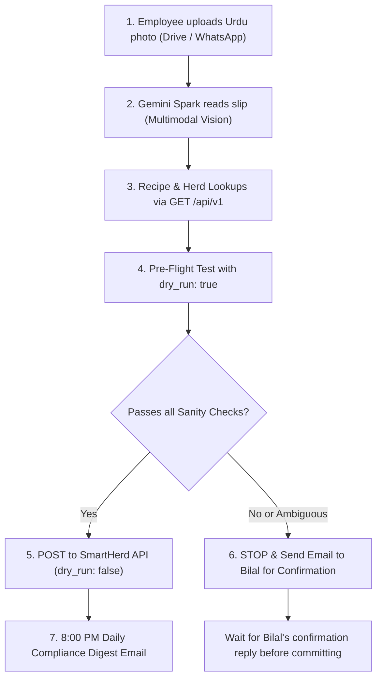

# BA Foods — Machine-to-Machine (M2M) & AI Integration API Specification (v1)

This specification defines the programmatic REST and Webhook interface for **BA Foods / SmartHerd**. It is engineered specifically for autonomous AI agents (such as **Gemini Spark**, Claude, GPT), automated IoT devices, and external webhooks (e.g. Google Sheets, ERP bridges).

---

## 1. Core Principles & Safeguards

1. **Zero-Cost Footprint:**
   * Runs as a consolidated lightweight serverless handler (`/api/v1.js`) on Vercel.
   * Single-table targeted queries execute in **10–25ms** consuming <40MB RAM.
2. **Strict Append-Only (Anti-Corruption):**
   * The AI API **prohibits destructive updates and in-place deletions**.
   * Historical feed logs, scale weights, and medication records cannot be silently overwritten.
   * If a record for the same entity/session already exists, the API returns `409 Conflict`.
3. **High-Precision Domain Sanity Checks:**
   * **Dates:** Strictly formatted as `YYYY-MM-DD`. Future dates ($>1$ day) and distant past ($>30$ days) are automatically rejected.
   * **Weights:** Biologically bounded ($40\text{ kg} - 1200\text{ kg}$). Any sudden jump ($>60\%$) or drop ($>50\%$) from an animal's previous recorded weight triggers a `422 SANITY_CHECK_FAILED` to catch OCR dropped/extra zero errors.
   * **Feed Batches:** Ingredient sum must match `total_batch_kg` within $\pm 1.0\text{ kg}$.
   * **Bunks:** Bunk scores must be $0 - 100\%$.
   * **Herd Status:** Operations cannot be performed on animals marked `Sold` or `Deceased`.
4. **Dry-Run Simulation Mode (`dry_run: true`):**
   * AI agents can pass `"dry_run": true` (or `?dry_run=true`) to simulate any operation. The server runs all validation, resolves tags, and returns the computed preview without committing anything to PostgreSQL.

---

## 2. Authentication & Base URL

* **Production Base URL:** `https://bafoods.pk/api/v1` (or local `http://localhost:5173/api/v1`)
* **Headers Required:**
  ```http
  Authorization: Bearer <BA_API_KEY>
  Content-Type: application/json
  x-agent-name: gemini-spark
  ```
  *(Alternatively, pass header `x-api-key: <BA_API_KEY>`)*

---

## 3. GET Endpoints (Data Fetching)

### 3.1 Live Compliance Summary
Fetch real-time daily operational compliance for feed sessions, bunk checks, and urgent health alerts.
* **Route:** `GET /api/v1/compliance/summary`
* **Query Parameters:**
  * `date` *(optional, string YYYY-MM-DD, defaults to today)*
* **Response Example (`200 OK`):**
```json
{
  "success": true,
  "date": "2026-09-14",
  "compliance": {
    "feed": {
      "is_fully_compliant": false,
      "completion_pct": 50,
      "completed_pens": 3,
      "total_active_pens": 6,
      "pen_details": {
        "A": { "complete": true, "logged_pct": 100, "feedings_recorded": 2 },
        "B": { "complete": true, "logged_pct": 100, "feedings_recorded": 2 },
        "C": { "complete": false, "logged_pct": 50, "feedings_recorded": 1 },
        "D": { "complete": false, "logged_pct": 50, "feedings_recorded": 1 },
        "E": { "complete": false, "logged_pct": 0, "feedings_recorded": 0 },
        "G": { "complete": true, "logged_pct": 100, "feedings_recorded": 2 }
      }
    },
    "bunk_checks": {
      "completed_pens": 6,
      "total_active_pens": 6,
      "pen_details": {
        "A": { "checked": true, "sessions": ["Morning"], "latest_bunk_score": 0 },
        "B": { "checked": true, "sessions": ["Morning"], "latest_bunk_score": 5 }
      }
    },
    "health_alerts": {
      "sick_animals_count": 1,
      "sick_animal_tags": ["36"]
    }
  }
}
```

---

### 3.2 Cattle Herd Roster
List all active cattle with pens, current weights, and Days on Feed (DOF).
* **Route:** `GET /api/v1/cattle/roster`
* **Query Parameters:**
  * `pen` *(optional, e.g. `?pen=C`)*
* **Response Example (`200 OK`):**
```json
{
  "success": true,
  "count": 16,
  "pen_filter": "C",
  "animals": [
    {
      "animal_id": 18,
      "tag": "36",
      "pen": "C",
      "breed": "Cholistani",
      "status": "Active",
      "weight_kg": 164.0,
      "entry_weight_kg": 142.0,
      "entry_date": "2026-08-15",
      "dof": 30,
      "target_weight_kg": 350.0
    }
  ]
}
```

---

### 3.3 Animal Passport & Full Dossier
Query complete biometric profile, weigh-in timeline, ADG history, treatments, active withholding, and pen transfer audit trail.
* **Route:** `GET /api/v1/cattle/passport?tag=36`
* **Query Parameters:**
  * `tag` *(required, e.g. `36` or `Tag 36`)*
* **Response Example (`200 OK`):**
```json
{
  "success": true,
  "animal": {
    "animal_id": 18,
    "tag": "36",
    "pen": "C",
    "breed": "Cholistani",
    "status": "Active",
    "current_weight_kg": 164.0,
    "entry_weight_kg": 142.0,
    "entry_date": "2026-08-15",
    "dof": 30,
    "under_withholding": false,
    "active_withholdings": []
  },
  "weight_history": [
    { "date": "2026-08-15", "weight_kg": 142.0, "adg": null },
    { "date": "2026-09-01", "weight_kg": 164.0, "adg": 1.29 }
  ],
  "treatments": [
    {
      "date": "2026-08-16",
      "type": "Vaccine",
      "medicine": "Panacur 10%",
      "dosage": "15 ml",
      "withholding": 14,
      "notes": "Intake Deworming"
    }
  ],
  "lifecycle_events": [
    {
      "date": "2026-09-10",
      "event_type": "pen_transfer",
      "from_pen": "E",
      "to_pen": "C",
      "note": "Moved Pen E → Pen C"
    }
  ]
}
```

---

### 3.4 Feed Logs & History
* **Route:** `GET /api/v1/feed/logs`
* **Query Parameters:**
  * `date` *(optional YYYY-MM-DD, defaults to today)*
  * `pen` *(optional, e.g. `?pen=C`)*

---

### 3.5 Pen Bunk Checks
* **Route:** `GET /api/v1/pen-checks`
* **Query Parameters:**
  * `date` *(optional YYYY-MM-DD, defaults to today)*

---

### 3.6 Active Medication Withholding Status
Returns all cattle currently under food-safety withholding. Critical check before scheduling slaughter or sale.
* **Route:** `GET /api/v1/health/withholding`
* **Response Example (`200 OK`):**
```json
{
  "success": true,
  "as_of_date": "2026-09-14",
  "count": 1,
  "withholding_active": [
    {
      "animal_id": 41,
      "tag": "23",
      "pen": "Sick",
      "treatment_date": "2026-09-08",
      "medicine": "Oxytetracycline 20%",
      "dosage": "20 ml",
      "withholding": 21,
      "safe_date": "2026-09-29"
    }
  ]
}
```

---

### 3.7 Upcoming Protocol Tasks
Returns quarantine protocol tasks due in the next 7 days.
* **Route:** `GET /api/v1/tasks/upcoming`

---

### 3.8 Feed Stock Inventory Summary
* **Route:** `GET /api/v1/inventory/summary`

---

### 3.9 Wanda & Premix Formulas Directory
Returns active in-house Wanda recipes, inclusion percentages, and available raw materials.
* **Route:** `GET /api/v1/premix/formulas`
* **Response Example (`200 OK`):**
```json
{
  "success": true,
  "wanda_recipes": [
    {
      "premix_type_id": "premix_1787943334876",
      "name": "Potato Max Wanda",
      "ingredients": [
        { "name": "Maize", "stock_item_id": "maizeGrain", "percentage": 51.02 },
        { "name": "Gluten Feed", "stock_item_id": "glutenFeed", "percentage": 34.78 },
        { "name": "Molasses", "stock_item_id": "item_1786402466074", "percentage": 6.95 },
        { "name": "Sodium bicarbonate (Meetha Soda)", "stock_item_id": "item_1785360083150", "percentage": 2.0 },
        { "name": "Limestone", "stock_item_id": "limestone", "percentage": 2.53 },
        { "name": "Urea", "stock_item_id": "urea", "percentage": 1.39 },
        { "name": "Mineral Pack", "stock_item_id": "mineralPack", "percentage": 0.8 },
        { "name": "Toxin Binder", "stock_item_id": "item_1785360204915", "percentage": 0.5 },
        { "name": "Monensin", "stock_item_id": "item_1787682319547", "percentage": 0.025 }
      ]
    }
  ],
  "available_raw_materials": [
    { "id": "maizeGrain", "name": "Maize" },
    { "id": "glutenFeed", "name": "Gluten Feed" },
    { "id": "urea", "name": "Urea" },
    { "id": "limestone", "name": "Limestone" },
    { "id": "mineralPack", "name": "Mineral Pack" }
  ]
}
```

---

## 4. POST Endpoints (Append-Only Actions)

Every POST endpoint supports `"dry_run": true` in the JSON body. If set, the server validates everything and returns a simulation without writing to the database.

---

### 4.1 Ingest Feed Log (TMR Batch Distribution)
* **Route:** `POST /api/v1/feed/logs`
* **Payload Format:**
```json
{
  "date": "2026-09-14",
  "pen": "C",
  "feeding_index": 1,
  "num_feedings": 2,
  "feeding_pct": 50,
  "total_batch_kg": 180.0,
  "ingredients": [
    { "name": "Corn Silage", "kg": 120.0 },
    { "name": "Wheat Straw", "kg": 20.0 },
    { "name": "Chokar", "kg": 25.0 },
    { "name": "Corn Grain Ground", "kg": 15.0 }
  ],
  "notes": "Morning split feeding",
  "dry_run": false
}
```
* **Sanity Rules:**
  * `feeding_index` must be 1, 2, or 3.
  * Sum of ingredients must equal `total_batch_kg` within $\pm 1.0\text{ kg}$.
  * If a log for `(date, pen, feeding_index)` already exists, returns `409 Conflict`.

---

### 4.2 Ingest Pen Bunk Check & Flagged Animals
* **Route:** `POST /api/v1/pen-checks`
* **Payload Format:**
```json
{
  "date": "2026-09-14",
  "pen": "C",
  "session": "Morning",
  "check_time": "06:30",
  "bunk_score_pct": 5,
  "head_count": 16,
  "head_pulled": 1,
  "flagged_tags": [
    { "tag": "36", "note": "Lethargic and droopy ears" }
  ],
  "notes": "Pen looks brisk, slick bunk except small pile at north corner.",
  "dry_run": false
}
```
* **Sanity Rules:**
  * `session` must be `"Morning"` or `"Evening"`.
  * `bunk_score_pct` must be $0 - 100$ ($0\% = \text{slick bunk}$, $100\% = \text{untouched}$).
  * Flagged tags automatically create a `pen_check_flag` event on that calf's dossier.

---

### 4.3 Log Health Treatment / Vaccine
* **Route:** `POST /api/v1/health/treatments`
* **Payload Format:**
```json
{
  "tag": "36",
  "date": "2026-09-14",
  "type": "Curative",
  "medicine": "Flunixin Meglumine",
  "dosage": "5 ml",
  "withholding": 4,
  "diagnosis": "Mild fever",
  "notes": "Administered IV via jugular vein.",
  "dry_run": false
}
```
* **Sanity Rules:**
  * Animal must exist in active herd (`status != 'Sold'` and `status != 'Deceased'`).
  * `dosage` string is required.
  * `withholding` must be an integer $\ge 0$.

---

### 4.4 Log Scale Weigh-In
* **Route:** `POST /api/v1/cattle/weights`
* **Payload Format:**
```json
{
  "tag": "36",
  "date": "2026-09-14",
  "weight": 172.5,
  "bypass_weight_sanity": false,
  "dry_run": false
}
```
* **Sanity Rules:**
  * Weight must be between $40\text{ kg}$ and $1200\text{ kg}$.
  * Anti-OCR-error check: If weight drops by $>50\%$ or increases by $>60\%$ compared to previous recorded weight, the call is rejected with `422 SANITY_CHECK_FAILED` unless `bypass_weight_sanity: true` is explicitly provided.
  * Automatically updates current weight on the animal and recalculates ADG.

---

### 4.5 Execute Pen Transfer
* **Route:** `POST /api/v1/cattle/pen-transfer`
* **Payload Format:**
```json
{
  "tags": ["36", "08"],
  "to_pen": "E",
  "reason": "Weight sorting after 30-day weigh-in",
  "dry_run": false
}
```
* **Sanity Rules:**
  * Moves cattle to `to_pen`.
  * Logs an immutable `pen_transfer` audit record in `ba_events` with previous pen, new pen, timestamp, and actor.

---

### 4.6 Ingest Feed Purchase Delivery
* **Route:** `POST /api/v1/purchasing/feed`
* **Payload Format:**
```json
{
  "date": "2026-09-14",
  "item_name": "Corn Silage",
  "quantity_kg": 5000,
  "rate_per_kg": 18.5,
  "supplier": "Al-Rehman Agri Farms",
  "notes": "Trolley #4 delivery - 68% moisture",
  "dry_run": false
}
```

---

### 4.7 Log In-House Wanda Batch (Standard or Custom Formulation)
Supports both pre-defined standard recipes and ad-hoc employee variations (e.g. 1.0% urea instead of 1.39%).
* **Route:** `POST /api/v1/premix/batches`
* **Option A: By Standard Formula**
```json
{
  "date": "2026-09-14",
  "premix_name": "Potato Max Wanda",
  "total_kg": 240.0,
  "bag_weight": 48.0,
  "bag_count": 5,
  "notes": "Standard morning mixing batch",
  "dry_run": false
}
```
* **Option B: By Custom Ingredient Breakdown (e.g. 1.0% Urea adjustment)**
```json
{
  "date": "2026-09-14",
  "premix_name": "Potato Max Wanda",
  "total_kg": 240.0,
  "custom_ingredients": [
    { "name": "Maize", "kg": 122.4 },
    { "name": "Gluten Feed", "kg": 83.5 },
    { "name": "Molasses", "kg": 16.7 },
    { "name": "Sodium bicarbonate (Meetha Soda)", "kg": 4.8 },
    { "name": "Limestone", "kg": 6.1 },
    { "name": "Urea", "kg": 2.4 },
    { "name": "Mineral Pack", "kg": 1.9 },
    { "name": "Toxin Binder", "kg": 1.2 },
    { "name": "Monensin", "kg": 1.0 }
  ],
  "notes": "Custom mixing with 1.0% urea as instructed by vet",
  "dry_run": false
}
```
* **Sanity Rules:**
  * Sum of `custom_ingredients` must equal `total_kg` ($\pm 1.0\text{ kg}$).
  * Deducts raw materials from inventory with `pen: 'PRODUCTION'`.
  * Automatically calculates FIFO cost and credits finished Wanda to stock under `supplier: 'In-house production'`.

---

## 5. Error Codes & AI Recovery Guidelines

| Status Code | Error Prefix | Cause | What the AI Agent Should Do |
| :--- | :--- | :--- | :--- |
| `401 Unauthorized` | `UNAUTHORIZED` | Invalid or missing `BA_API_KEY`. | Check environment variable and header configuration. |
| `409 Conflict` | `RECORD_ALREADY_EXISTS` | Record already exists for this pen/date/session. | Do NOT retry. Alert the user that this session was already logged. If it is an additional feeding, increment `feeding_index`. |
| `422 Unprocessable` | `SANITY_CHECK_FAILED` | Input failed domain rules (e.g. ingredient sum mismatch, weight delta $>50\%$, bunk $>100\%$). | Inspect the error message, verify OCR/document numbers, fix the fields, or ask the user for confirmation. |
| `422 Unprocessable` | `ANIMAL_NOT_FOUND` | Tag ID is not recognized in active herd. | Check if tag has a typo or if calf is registered under a previous tag. |
| `422 Unprocessable` | `ANIMAL_INACTIVE` | Calf is marked Sold or Deceased. | Abort logging; notify user that the animal is no longer in the active herd. |
| `500 Server Error` | `CONFIG_ERROR` | Database connection issue. | Retry once after a 2-second delay. |

---

## 6. Testing with cURL

### Test 1: Fetch Live Compliance
```bash
curl -s -H "Authorization: Bearer YOUR_API_KEY" \
  "https://bafoods.pk/api/v1/compliance/summary"
```

### Test 2: Dry-Run Feed Log
```bash
curl -s -X POST -H "Authorization: Bearer YOUR_API_KEY" \
  -H "Content-Type: application/json" \
  -d '{
    "date": "2026-09-14",
    "pen": "C",
    "feeding_index": 1,
    "num_feedings": 2,
    "total_batch_kg": 100.0,
    "ingredients": [{"name": "Silage", "kg": 100.0}],
    "dry_run": true
  }' \
  "https://bafoods.pk/api/v1/feed/logs"
```

---

## 7. Gemini Spark Autonomous Daily Workflow Blueprint

This section provides the end-to-end operational instructions for configuring **Google / Gemini Spark** to automate daily farm logs from employee photos.



### Spark Operational Rules:
1. **Multimodal Extraction:**
   * When an employee uploads an Urdu clipboard photo (feed slip, bunk reading, weigh ticket, or Wanda mixing sheet):
   * Translate Urdu feed names to canonical API names (e.g. مکئی $\rightarrow$ `Maize`, چوکر $\rightarrow$ `Chokar`, سائلیج $\rightarrow$ `Corn Silage`, یوریا $\rightarrow$ `Urea`).
2. **Pre-flight via `dry_run: true`:**
   * Never push unverified data. Spark must first execute a dry-run call (`dry_run: true`).
3. **The Stop & Confirm Escalation Rule (Zero Blind Guesses):**
   * If:
     - Handwriting is smudged (e.g., Tag 38 vs 39).
     - Ingredient sum doesn't match total batch kg.
     - A Wanda formula has an unexpected variation (e.g. Urea is 1% instead of 1.39%) that wasn't approved.
     - A bunk reading is missing or illegible.
   * **Spark must STOP immediately and email you:**
     * **Subject:** `[BA Foods Alert] Action Required: Ambiguity in Daily Feed Slip`
     * **Body:** Embeds the cropped image snippet, describes what it extracted, and provides concrete multiple-choice options for you to reply to.
4. **Daily 8:00 PM Evening Digest Report:**
   * Every evening at 8:00 PM, Spark queries:
     * `GET /api/v1/compliance/summary`
     * `GET /api/v1/feed/logs`
     * `GET /api/v1/pen-checks`
     * `GET /api/v1/tasks/upcoming`
   * Spark emails you a concise executive summary:
     * Feed compliance (all pens covered or list of missed sessions).
     * Bunk readings (slick bunks vs carryover).
     * In-house Wanda produced (batches, kg, and cost/kg).
     * Cattle health & active withholding alerts.
     * Scheduled protocol tasks due tomorrow.

