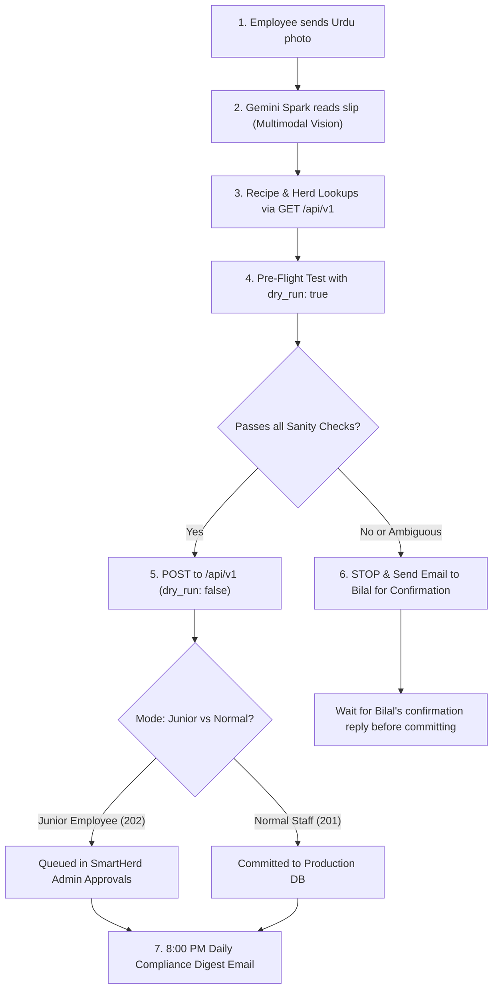

# BA Foods — Machine-to-Machine (M2M) & AI Integration API Specification (v1)

This specification defines the programmatic REST and Webhook interface for **BA Foods / SmartHerd**. It is engineered specifically for autonomous AI agents (such as **Gemini Spark**, Claude, GPT), automated IoT devices, and external webhooks (e.g. Google Sheets, ERP bridges).

---

## 1. Core Principles & Governance Safeguards

### 1.1 Dual Governance Architecture (Junior Employee vs. Normal Staff Mode)
To eliminate any risk of an AI agent "going rogue" or corrupting farm records, the API implements a **two-tier governance model** controlled by an Admin Switch:

1. **Junior Employee Mode (`ai_require_approval = true`, Default):**
   * The AI functions strictly like a newly onboarded junior employee.
   * Every action submitted by the AI (daily feeding logs, bunk checks, scale weigh-ins, health treatments, feed/medicine purchases, animal intakes, and custom mixing batches) is validated by mathematical and biological guards, then **queued into the SmartHerd Admin Approval queue (`ba_pending_approvals`)** with HTTP `202 Accepted` (`status: "pending_approval"`).
   * Nothing touches the live active herd or feed database until the Admin (Bilal) reviews and approves it in the SmartHerd portal.
2. **Normal SmartHerd Staff Mode (`ai_require_approval = false`):**
   * Once you observe that the AI extracts and logs data reliably, you can toggle the switch to "Normal Staff".
   * Valid entries commit directly to the live production database with HTTP `201 Created` (`status: "committed"`), tagged with `created_by: 'api:gemini-spark'`.
   * Even in this mode, the hard biological sanity clamps remain fully active (it is physically impossible to drop tables, delete records, or enter absurd values).

### 1.2 The Admin Autonomy Switch
The Admin can toggle between Junior Employee Mode and Normal Staff Mode at any time via:
* **SmartHerd Portal UI:** A dedicated **AI Assistant Governance Switch** banner is rendered at the top of the **Admin Approvals** dashboard for superadmins.
* **API Endpoints:**
  * `GET /api/v1/system/approval-mode` — Inspect the current mode.
  * `POST /api/v1/system/approval-mode` — Update the mode (`{"require_approval": false}`).
* **Per-Request Override:**
  * HTTP Header: `x-require-approval: true` or `false`
  * JSON Body: `"require_approval": true` or `false`

### 1.3 Zero-Cost & Anti-Corruption Safeguards
1. **Zero Added Vercel Cost:** Single-table pooled queries execute in **10–25ms** using <40MB RAM.
2. **Strict Append-Only (No Overwrites or Deletes):** Historical records cannot be deleted or wiped out over the AI API. Existing records on the same key return `409 Conflict`.
3. **High-Precision Biological Sanity Clamps:**
   * **Dates:** Format `YYYY-MM-DD`. Future dates ($>1$ day) and distant past ($>30$ days) are blocked.
   * **Weights:** Clamped between $40\text{ kg} - 1200\text{ kg}$. Weight drops $>50\%$ or spikes $>60\%$ trigger `422 SANITY_CHECK_FAILED` to catch OCR dropped/extra zero errors.
   * **Feed Batches:** Ingredient mass balance must sum to `total_batch_kg` within $\pm 1.0\text{ kg}$. Daily cumulative feeding cannot exceed $100\%$.
   * **Bunk Scores:** Must be between $0 - 100\%$.
   * **Anti-Ghost Feeding:** Feeds cannot be logged to a pen with 0 active animals.
4. **Dry-Run Simulation Mode (`dry_run: true`):**
   * Pass `"dry_run": true` (or `?dry_run=true`) to simulate any payload without writing to the database.

---

## 2. Authentication & Base URL

* **Production Base URL:** `https://bafoods.pk/api/v1` (or local `http://localhost:5173/api/v1`)
* **Headers Required:**
  ```http
  Authorization: Bearer <BA_API_KEY>
  Content-Type: application/json
  x-agent-name: gemini-spark
  ```
  *(Alternatively, pass header `x-api-key: <BA_API_KEY>`)*

---

## 3. GET Endpoints (Data Fetching & Verification)

### 3.1 Live Compliance Summary
Fetch real-time daily operational compliance for feed sessions, bunk checks, and urgent health alerts.
* **Route:** `GET /api/v1/compliance/summary`
* **Query Parameters:** `date` *(optional YYYY-MM-DD, defaults to today)*
* **Response Example (`200 OK`):**
```json
{
  "success": true,
  "date": "2026-09-14",
  "compliance": {
    "feed": {
      "is_fully_compliant": false,
      "completion_pct": 50,
      "completed_pens": 3,
      "total_active_pens": 6,
      "pen_details": {
        "A": { "complete": true, "logged_pct": 100, "feedings_recorded": 2 },
        "B": { "complete": true, "logged_pct": 100, "feedings_recorded": 2 },
        "C": { "complete": false, "logged_pct": 50, "feedings_recorded": 1 },
        "D": { "complete": false, "logged_pct": 50, "feedings_recorded": 1 },
        "E": { "complete": false, "logged_pct": 0, "feedings_recorded": 0 },
        "G": { "complete": true, "logged_pct": 100, "feedings_recorded": 2 }
      }
    },
    "bunk_checks": {
      "completed_pens": 6,
      "total_active_pens": 6,
      "pen_details": {
        "A": { "checked": true, "sessions": ["Morning"], "latest_bunk_score": 0 },
        "B": { "checked": true, "sessions": ["Morning"], "latest_bunk_score": 5 }
      }
    },
    "health_alerts": {
      "sick_animals_count": 1,
      "sick_animal_tags": ["36"]
    }
  }
}
```

---

### 3.2 Cattle Herd Roster
List all active cattle with pens, current weights, and Days on Feed (DOF).
* **Route:** `GET /api/v1/cattle/roster`
* **Query Parameters:** `pen` *(optional, e.g. `?pen=C`)*

---

### 3.3 Cattle Passport / Dossier
* **Route:** `GET /api/v1/cattle/passport?tag=<TAG>`

---

### 3.4 Daily Feed Distribution Logs
* **Route:** `GET /api/v1/feed/logs?date=<YYYY-MM-DD>`

---

### 3.5 Daily Pen Checks & Bunk Scores
* **Route:** `GET /api/v1/pen-checks?date=<YYYY-MM-DD>`

---

### 3.6 Active Medical Withholding Alerts
* **Route:** `GET /api/v1/health/withholding`

---

### 3.7 Upcoming Protocol Tasks
Returns quarantine protocol tasks due in the next 7 days.
* **Route:** `GET /api/v1/tasks/upcoming`

---

### 3.8 Feed Stock Inventory Summary
* **Route:** `GET /api/v1/inventory/summary`

---

### 3.9 Wanda & Premix Formulas Directory
Returns active in-house Wanda recipes, inclusion percentages, and available raw materials.
* **Route:** `GET /api/v1/premix/formulas`

---

### 3.10 AI Governance Status
Check whether the AI is currently operating in Junior Employee mode or Normal Staff mode.
* **Route:** `GET /api/v1/system/approval-mode`
* **Response Example (`200 OK`):**
```json
{
  "success": true,
  "ai_require_approval": true,
  "mode": "junior_employee",
  "description": "Junior Employee Mode active. All AI tasks (feed logs, cattle weights, treatments, purchases, wanda mixing) are held in ba_pending_approvals for Admin review."
}
```

---

## 4. POST Endpoints (Append-Only Actions)

Every POST endpoint supports `"dry_run": true` for simulation. When `dry_run: false`:
* In **Junior Employee Mode (`ai_require_approval = true`)**, the endpoint returns **HTTP 202 Accepted** with `"status": "pending_approval"` and an `"approval_id"` matching the row in the SmartHerd portal's Admin Approvals dashboard.
* In **Normal Staff Mode (`ai_require_approval = false`)**, the endpoint returns **HTTP 201 Created** with `"status": "committed"`.

---

### 4.1 Ingest Feed Log (TMR Batch Distribution)
* **Route:** `POST /api/v1/feed/logs`
* **Payload:**
```json
{
  "date": "2026-09-14",
  "pen": "C",
  "feeding_index": 1,
  "num_feedings": 2,
  "feeding_pct": 50,
  "total_batch_kg": 180.0,
  "ingredients": [
    { "name": "Corn Silage", "kg": 120.0 },
    { "name": "Wheat Straw", "kg": 20.0 },
    { "name": "Chokar", "kg": 25.0 },
    { "name": "Corn Grain Ground", "kg": 15.0 }
  ],
  "notes": "Morning split feeding",
  "dry_run": false
}
```
* **Junior Employee Response (`202 Accepted`):**
```json
{
  "success": true,
  "status": "pending_approval",
  "approval_id": 867,
  "mode": "junior_employee",
  "action": "ADD_FEED_LOG",
  "message": "Feed log for Pen C on 2026-09-14 submitted in Junior Employee mode. Queued for Admin review in SmartHerd portal.",
  "details": {
    "pen": "C",
    "date": "2026-09-14",
    "feeding_index": 1,
    "num_feedings": 2,
    "total_batch_kg": 180.0
  }
}
```
* **Normal Staff Response (`201 Created`):**
```json
{
  "success": true,
  "status": "committed",
  "mode": "normal_staff",
  "id": 1420,
  "message": "Feed logged successfully for Pen C on 2026-09-14 (#1/2)."
}
```

---

### 4.2 Ingest Pen Bunk Check & Flagged Animals
* **Route:** `POST /api/v1/pen-checks`
* **Payload:**
```json
{
  "date": "2026-09-14",
  "pen": "C",
  "session": "Morning",
  "check_time": "06:30",
  "bunk_score_pct": 5,
  "head_count": 16,
  "head_pulled": 1,
  "flagged_tags": [
    { "tag": "36", "note": "Lethargic and droopy ears" }
  ],
  "notes": "Pen looks brisk, slick bunk except small pile at north corner.",
  "dry_run": false
}
```
* **Junior Employee Response (`202 Accepted`):**
```json
{
  "success": true,
  "status": "pending_approval",
  "approval_id": 868,
  "mode": "junior_employee",
  "action": "LOG_PEN_CHECK",
  "message": "Pen check for Pen C (Morning) submitted in Junior Employee mode. Queued for Admin review in SmartHerd portal."
}
```

---

### 4.3 Log Health Treatment / Vaccine
* **Route:** `POST /api/v1/health/treatments`
* **Payload:**
```json
{
  "tag": "36",
  "date": "2026-09-14",
  "type": "Curative",
  "medicine": "Flunixin Meglumine",
  "dosage": "5 ml",
  "withholding": 4,
  "diagnosis": "Mild fever",
  "notes": "Administered IV via jugular vein.",
  "dry_run": false
}
```
* **Junior Employee Response (`202 Accepted`):**
```json
{
  "success": true,
  "status": "pending_approval",
  "approval_id": 869,
  "mode": "junior_employee",
  "action": "LOG_TREATMENT",
  "message": "Treatment for Tag 36 (Flunixin Meglumine) submitted in Junior Employee mode. Queued for Admin review in SmartHerd portal."
}
```

---

### 4.4 Log Scale Weigh-In
* **Route:** `POST /api/v1/cattle/weights`
* **Payload:**
```json
{
  "tag": "36",
  "date": "2026-09-14",
  "weight": 172.5,
  "bypass_weight_sanity": false,
  "dry_run": false
}
```
* **Junior Employee Response (`202 Accepted`):**
```json
{
  "success": true,
  "status": "pending_approval",
  "approval_id": 870,
  "mode": "junior_employee",
  "action": "LOG_WEIGHT",
  "message": "Weight entry of 172.5 kg for Tag 36 submitted in Junior Employee mode. Queued for Admin review in SmartHerd portal.",
  "details": {
    "animal_id": 18,
    "tag": "36",
    "weight_kg": 172.5,
    "previous_weight_kg": 160.0,
    "weight_delta_kg": 12.5,
    "adg": 1.25,
    "date": "2026-09-14"
  }
}
```

---

### 4.5 Execute Pen Transfer
* **Route:** `POST /api/v1/cattle/pen-transfer`
* **Payload:**
```json
{
  "tags": ["36", "08"],
  "to_pen": "E",
  "reason": "Weight sorting after 30-day weigh-in",
  "dry_run": false
}
```
* **Junior Employee Response (`202 Accepted`):**
```json
{
  "success": true,
  "status": "pending_approval",
  "approval_ids": [871, 872],
  "mode": "junior_employee",
  "action": "UPDATE_ANIMAL",
  "message": "Pen transfer for 2 animal(s) to Pen E submitted in Junior Employee mode. Queued for Admin review in SmartHerd portal."
}
```

---

### 4.6 Ingest Feed or Medicine Purchase
* **Routes:** `POST /api/v1/purchasing/feed` or `POST /api/v1/purchasing/medicine`
* **Feed Purchase Payload:**
```json
{
  "date": "2026-09-14",
  "item_name": "Corn Silage",
  "quantity_kg": 5000,
  "rate_per_kg": 18.5,
  "supplier": "Al-Rehman Agri Farms",
  "notes": "Trolley #4 delivery - 68% moisture",
  "dry_run": false
}
```
* **Medicine Purchase Payload:**
```json
{
  "date": "2026-09-14",
  "item_name": "Amovet Inj 100ml",
  "quantity": 10,
  "unit": "vials",
  "rate": 1850,
  "supplier": "Ghazi Vet Pharmacy",
  "notes": "Batch #AM-2026-09",
  "dry_run": false
}
```
* **Junior Employee Response (`202 Accepted`):**
```json
{
  "success": true,
  "status": "pending_approval",
  "approval_id": 873,
  "mode": "junior_employee",
  "action": "ADD_FEED_PURCHASE",
  "message": "Purchase receipt for 5000 kg Corn Silage submitted in Junior Employee mode. Queued for Admin review in SmartHerd portal."
}
```

---

### 4.7 Ingest New Cattle Arrival / Intake
* **Route:** `POST /api/v1/cattle/intake` (or `/api/v1/purchasing/animal`)
* **Payload:**
```json
{
  "tag": "145",
  "rfid": "982000421098145",
  "breed": "Cholistani Cross",
  "entry_date": "2026-09-14",
  "entry_weight": 195.0,
  "purchase_price": 95000,
  "source": "Multan Mandi",
  "target_adg": 1.3,
  "pen": "Quarantine",
  "notes": "Arrived in good health, intake deworming given.",
  "dry_run": false
}
```
* **Junior Employee Response (`202 Accepted`):**
```json
{
  "success": true,
  "status": "pending_approval",
  "approval_id": 874,
  "mode": "junior_employee",
  "action": "ADD_ANIMAL",
  "message": "Cattle intake for Tag 145 submitted in Junior Employee mode. Queued for Admin review in SmartHerd portal."
}
```

---

### 4.8 Log In-House Wanda Batch (Standard or Custom Formulation)
* **Route:** `POST /api/v1/premix/batches`
* **Custom Breakdown Payload (e.g. 1.0% Urea adjustment):**
```json
{
  "date": "2026-09-14",
  "premix_name": "Potato Max Wanda",
  "total_kg": 240.0,
  "custom_ingredients": [
    { "name": "Maize", "kg": 122.4 },
    { "name": "Gluten Feed", "kg": 83.5 },
    { "name": "Molasses", "kg": 16.7 },
    { "name": "Sodium bicarbonate (Meetha Soda)", "kg": 4.8 },
    { "name": "Limestone", "kg": 6.1 },
    { "name": "Urea", "kg": 2.4 },
    { "name": "Mineral Pack", "kg": 1.9 },
    { "name": "Toxin Binder", "kg": 1.2 },
    { "name": "Monensin", "kg": 1.0 }
  ],
  "notes": "Custom mixing with 1.0% urea as instructed by vet",
  "dry_run": false
}
```
* **Junior Employee Response (`202 Accepted`):**
```json
{
  "success": true,
  "status": "pending_approval",
  "approval_id": 875,
  "mode": "junior_employee",
  "action": "SAVE_SETTINGS",
  "message": "Wanda mixing batch (240 kg of Potato Max Wanda) submitted in Junior Employee mode. Queued for Admin review in SmartHerd portal."
}
```

---

### 4.9 Toggle AI Governance Mode (Admin Switch)
Allows switching the AI between Junior Employee Mode and Normal Staff Mode.
* **Route:** `POST /api/v1/system/approval-mode`
* **Payload:**
```json
{
  "require_approval": false
}
```
* **Response Example (`200 OK`):**
```json
{
  "success": true,
  "ai_require_approval": false,
  "mode": "normal_staff",
  "message": "AI governance switched to Normal SmartHerd Staff (Direct Execution)."
}
```

---

## 5. Error Codes & AI Recovery Guidelines

| Status Code | Error Prefix | Cause | What the AI Agent Should Do |
| :--- | :--- | :--- | :--- |
| `401 Unauthorized` | `UNAUTHORIZED` | Invalid or missing `BA_API_KEY`. | Check environment variable and header configuration. |
| `409 Conflict` | `RECORD_ALREADY_EXISTS` | Record already exists for this pen/date/session. | Do NOT retry. Alert the user that this session was already logged. If it is an additional feeding, increment `feeding_index`. |
| `409 Conflict` | `DUPLICATE_TREATMENT_BLOCKED` | Same medicine already administered to animal on this date. | Pass `allow_duplicate_dose: true` if an intentional repeat dose (e.g. BID). |
| `422 Unprocessable` | `SANITY_CHECK_FAILED` | Input failed domain rules (e.g. ingredient sum mismatch, weight delta $>50\%$, bunk $>100\%$). | Inspect error details, verify numbers against photo, fix fields, or ask user for confirmation. |
| `422 Unprocessable` | `ANIMAL_NOT_FOUND` | Tag ID is not recognized in active herd. | Check if tag has a typo or was registered under an RFID tag. |
| `422 Unprocessable` | `ANIMAL_INACTIVE` | Calf is marked Sold or Deceased. | Abort logging; notify user that the animal is no longer in the active herd. |
| `500 Server Error` | `CONFIG_ERROR` | Database connection issue. | Retry once after a 2-second delay. |

---

## 6. Gemini Spark Autonomous Daily Workflow Blueprint



### Spark Operational Blueprint:
1. **Multimodal Extraction:** Read Urdu paper slips and map them to canonical names (`مکئی` $\rightarrow$ `Maize`, `چوکر` $\rightarrow$ `Chokar`, `سائلیج` $\rightarrow$ `Corn Silage`, `یوریا` $\rightarrow$ `Urea`).
2. **Pre-Flight Test:** Always run `dry_run: true` first to verify that pen animal counts, date ranges, and mass balances pass.
3. **Submit Entry:** Push the verified entry.
   * If the API returns `202 Accepted` (`status: "pending_approval"`), Spark notes: *"Logged #867 — Queued in SmartHerd Admin Approvals for your sign-off."*
   * If the API returns `201 Created` (`status: "committed"`), Spark notes: *"Committed directly to live herd database."*
4. **The Stop & Confirm Escalation Rule:** If a tag or number is smudged, or ingredient mass doesn't balance, Spark stops immediately and emails Bilal with a cropped snippet of the slip and clear options.
5. **Daily 8:00 PM Evening Digest Email:** Summarizes feed compliance, bunk scores, health alerts, and any pending approvals waiting in the portal.
